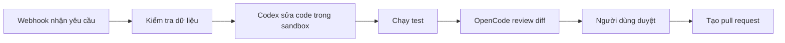

# AgentFlow

AgentFlow là ý tưởng nền tảng thiết kế workflow bằng cách kéo thả, theo trải nghiệm tương tự n8n, cho phép kết hợp các bước gọi API, xử lý dữ liệu, chờ duyệt và chạy AI agent như Codex hoặc OpenCode trong cùng một flow.

**Trạng thái: thiết kế ban đầu, chưa có ứng dụng chạy được.** Bộ tài liệu tiếng Việt được nghiên cứu ngày **05/09/2026**. Công nghệ, API nội bộ và lộ trình dưới đây là đề xuất, chưa phải tính năng đã triển khai.

Đề xuất chính: **TypeScript + React Flow + NestJS + PostgreSQL + Temporal + runner cô lập cho agent**. Dùng **event-driven kết hợp orchestration**: Temporal điều phối và lưu bền trạng thái thực thi; các sự kiện phục vụ trigger, cập nhật tiến độ và tích hợp. MVP chưa cần Kafka hoặc một message broker riêng.

Ví dụ flow mục tiêu:

Đọc tài liệu theo thứ tự:

| Tài liệu | Nội dung |
| --- | --- |
| [Kiến trúc và công nghệ](docs/architecture.md) | Phạm vi sản phẩm, stack, thành phần, dữ liệu và lựa chọn workflow engine |
| [Thiết kế event-driven](docs/event-driven.md) | Command/event, outbox, retry, idempotency, khôi phục và trạng thái |
| [Tích hợp AI agent](docs/agent-integration.md) | Codex, OpenCode, adapter, session, approval và sandbox |
| [Đặc tả workflow](docs/workflow-spec.md) | Node, edge, dữ liệu, ví dụ flow và API dự kiến |
| [Lộ trình triển khai](docs/roadmap.md) | Các mốc MVP, tiêu chí nghiệm thu, triển khai và vận hành |

Các trang có nguồn chính thức đặt cạnh thông tin được kiểm chứng. Quyết định thiết kế của AgentFlow được phân biệt với khả năng do nhà cung cấp công bố. Không có benchmark hay thử nghiệm tích hợp thực tế trong đợt viết tài liệu này.

Giấy phép của repository: [MIT](LICENSE).
