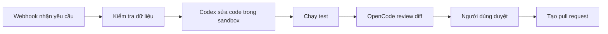

# AgentFlow

AgentFlow là ý tưởng nền tảng thiết kế workflow bằng cách kéo thả, theo trải nghiệm tương tự n8n, cho phép kết hợp các bước gọi API, xử lý dữ liệu, chờ duyệt và chạy AI agent như Codex hoặc OpenCode trong cùng một flow.

**Trạng thái: đã có [FastAPI system](src/system/README.md) và [agent integration Deep Agents/LangGraph](src/agent/README.md); engine thực thi và UI đang tiếp tục phát triển.** Bộ tài liệu tiếng Việt được nghiên cứu ngày **05/09/2026**.

Chạy mẫu không cần API key từ thư mục gốc: `cd src/agent`, `uv sync --locked`, rồi `uv run agent --demo --task "Plan a small workflow"`. Demo dùng model giả lập qua graph thật; hướng dẫn model thật, HTTP và client Node.js nằm trong README của agent.

Chạy toàn bộ hạ tầng local bằng Docker: sao chép `.env.example` thành `.env`, thay các mật khẩu, rồi dùng `docker compose up -d --build`. Xem [hướng dẫn Docker, Keycloak và PostgreSQL](infra/README.md).

Đề xuất chính: **TypeScript + React Flow + NestJS + PostgreSQL + Temporal + runner cô lập cho agent**. Dùng **event-driven kết hợp orchestration**: Temporal điều phối và lưu bền trạng thái thực thi; các sự kiện phục vụ trigger, cập nhật tiến độ và tích hợp. MVP chưa cần Kafka hoặc một message broker riêng.

Ví dụ flow mục tiêu:

Đọc tài liệu theo thứ tự:

| Tài liệu | Nội dung |
| --- | --- |
| [Kiến trúc và công nghệ](docs/architecture.md) | Phạm vi sản phẩm, stack, thành phần, dữ liệu và lựa chọn workflow engine |
| [Thiết kế event-driven](docs/event-driven.md) | Command/event, outbox, retry, idempotency, khôi phục và trạng thái |
| [Agent mẫu chạy được](src/agent/README.md) | Deep Agents, CLI, HTTP, input/output JSON và demo không cần API key |
| [Hạ tầng Docker](infra/README.md) | Agent API, Keycloak, PostgreSQL, token development và cấu hình LLM self-host |
| [Tích hợp AI agent](docs/agent-integration.md) | Mẫu Deep Agents hiện tại và hướng mở rộng Codex/OpenCode sau này |
| [Đặc tả workflow](docs/workflow-spec.md) | Node, edge, dữ liệu, ví dụ flow và API dự kiến |
| [Lộ trình triển khai](docs/roadmap.md) | Các mốc MVP, tiêu chí nghiệm thu, triển khai và vận hành |

Các trang có nguồn chính thức đặt cạnh thông tin được kiểm chứng. Agent mẫu có kiểm thử tự động bằng graph thật và model giả lập; chưa benchmark hoặc kiểm chứng lời gọi provider thật. Các kiến trúc triển khai dài hạn vẫn là đề xuất.

Giấy phép của repository: [MIT](LICENSE).
