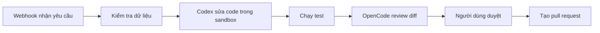

# AgentFlow

AgentFlow là ý tưởng nền tảng thiết kế workflow bằng cách kéo thả, theo trải nghiệm tương tự n8n, cho phép kết hợp các bước gọi API, xử lý dữ liệu, chờ duyệt và chạy AI agent như Codex hoặc OpenCode trong cùng một flow.

**Trạng thái: đã có [FastAPI system](src/system/README.md) và [agent mặc định Deep Agents/LangGraph](src/agents/default/README.md) chạy bằng [một container cho mỗi attempt](docs/ephemeral-agent-runtime.md); runtime tùy biến được tổ chức thành các thư mục con trong [`src/agents`](src/agents/README.md).** Bộ tài liệu tiếng Việt được nghiên cứu ngày **05/09/2026**.

Chạy Agent mặc định với LLM thật từ thư mục gốc: `cd src/agents/default`, `uv sync --locked`, cấu hình provider/model theo README của agent, rồi dùng `uv run --env-file .env agent --task "Plan a small workflow"`.

Chạy toàn bộ hạ tầng local bằng Docker: sao chép `.env.example` thành `.env`, thay các mật khẩu, rồi dùng `docker compose up -d --build`. Mở giao diện tại `http://localhost:3000`. Compose có sẵn [Filesystem MCP demo](src/mcp-filesystem/README.md) để Agent thử đọc/ghi file trong container cô lập. Xem [hướng dẫn Docker, Keycloak và PostgreSQL](infra/README.md).

Đề xuất chính: **TypeScript + React Flow + NestJS + PostgreSQL + Temporal + runner cô lập cho agent**. Dùng **event-driven kết hợp orchestration**: Temporal điều phối và lưu bền trạng thái thực thi; các sự kiện phục vụ trigger, cập nhật tiến độ và tích hợp. MVP chưa cần Kafka hoặc một message broker riêng.

Ví dụ flow mục tiêu:

```mermaid
flowchart LR
    A[Webhook nhận yêu cầu] --> B[Kiểm tra dữ liệu]
    B --> C[Codex sửa code trong sandbox]
    C --> D[Chạy test]
    D --> E[OpenCode review diff]
    E --> F[Người dùng duyệt]
    F --> G[Tạo pull request]
```

Đọc tài liệu theo thứ tự:

| Tài liệu | Nội dung |
| --- | --- |
| [Kiến trúc và công nghệ](docs/architecture.md) | Phạm vi sản phẩm, stack, thành phần, dữ liệu và lựa chọn workflow engine |
| [Thiết kế event-driven](docs/event-driven.md) | Command/event, outbox, retry, idempotency, khôi phục và trạng thái |
| [Các Agent runtime](src/agents/README.md) | Quy ước thư mục runtime tùy biến và contract container |
| [Agent mặc định chạy được](src/agents/default/README.md) | Deep Agents, CLI, HTTP, input/output JSON và cấu hình LLM thật |
| [Giao diện web](src/web/README.md) | React/Vite workflow studio, đăng nhập Keycloak và thao tác workflow |
| [Hạ tầng Docker](infra/README.md) | Agent API, Keycloak, PostgreSQL, token development và cấu hình LLM self-host |
| [Tích hợp AI agent](docs/agent-integration.md) | Mẫu Deep Agents hiện tại và hướng mở rộng Codex/OpenCode sau này |
| [Agent runtime dùng một lần](docs/ephemeral-agent-runtime.md) | Thiết kế một container cho mỗi agent node attempt, lifecycle, cô lập, backpressure và lộ trình triển khai |
| [Kế hoạch bổ sung lõi workflow/runtime](docs/core-runtime-implementation-plan.md) | Backlog P0–P2, migration, API/runtime contract, thứ tự triển khai và tiêu chí nghiệm thu |
| [Đặc tả workflow](docs/workflow-spec.md) | Node, edge, dữ liệu, ví dụ flow và API dự kiến |
| [Lưu trữ và xử lý workflow](docs/workflow-execution.md) | PostgreSQL schema, vòng đời draft/version/run và luồng worker mục tiêu |
| [Quản lý skill](docs/skills.md) | Built-in/user skill, lựa chọn trực tiếp tại Agent node và snapshot khi publish |
| [Lộ trình triển khai](docs/roadmap.md) | Các mốc MVP, tiêu chí nghiệm thu, triển khai và vận hành |

Các trang có nguồn chính thức đặt cạnh thông tin được kiểm chứng. Agent chỉ có đường gọi provider/model thật; unit test cô lập network bằng mock tại biên runtime. Các kiến trúc triển khai dài hạn vẫn là đề xuất.

Giấy phép của repository: [MIT](LICENSE).
