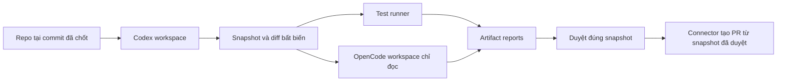

# Tích hợp agent vào flow

## Hướng triển khai hiện tại: Deep Agents trước

Theo phạm vi mới, dùng [agent Python mẫu trong src/agent](../src/agent/README.md) làm runtime đầu tiên. Agent dùng `create_deep_agent` trên LangGraph, tool danh mục node và output có schema để đề xuất một kế hoạch workflow nhỏ. Có CLI JSON stdin/stdout, `POST /v1/runs` đồng bộ và client Node.js minh họa.

Đường thử nghiệm: **task/context → Deep Agents → WorkflowPlan JSON → output của agent node**. Demo dùng model giả lập qua graph thật; chế độ live mặc định gọi LLM self-host qua OpenAI-compatible Chat Completions API và vẫn cho phép chọn Anthropic. Kết quả là đề xuất, chưa tự chuyển thành DSL hoặc thực thi hành động.

Mẫu chưa triển khai contract `startOrAttach`, session, streaming, approval hay recovery ở các phần dưới. Worker có thể gọi HTTP/CLI để thử ranh giới tích hợp trước. Chi tiết Codex/OpenCode bên dưới được giữ làm **thiết kế mở rộng sau**, không còn là việc cần tích hợp ngay trong PoC đầu tiên.

Ngày kiểm chứng tài liệu nhà cung cấp: **05/09/2026**. Các interface và chính sách AgentFlow dưới đây là thiết kế đề xuất, chưa phải adapter đã chạy thử.

## 1. Chọn bề mặt tích hợp

| Runtime | Cách tích hợp đã được tài liệu chính thức mô tả | Đề xuất cho AgentFlow |
| --- | --- | --- |
| Codex SDK | TypeScript package `@openai/codex-sdk`, tạo/tiếp tục/resume thread | MVP cho tác vụ tự động có đầu vào/đầu ra rõ |
| Codex App Server | JSON-RPC hai chiều, thread/turn, streamed events và approvals | Giai đoạn cần UI tương tác giữa turn; ưu tiên stdio nội bộ runner |
| Codex CLI | `codex exec --json`; `--output-schema` cho kết quả có cấu trúc | PoC hoặc adapter CLI thay thế khi phù hợp |
| OpenCode server | `opencode serve`, HTTP/OpenAPI | Runtime chạy trong sandbox, không public endpoint trực tiếp |
| OpenCode SDK | `@opencode-ai/sdk`, quản lý session, gửi prompt, abort và stream sự kiện SSE | MVP qua SDK kết nối server trong runner |

Nguồn cho Codex SDK: [Codex SDK](https://learn.chatgpt.com/docs/codex-sdk). Tài liệu cũng ghi `codex mcp-server` đã deprecated; không chọn nó làm nền tích hợp mới.

App Server dùng JSON-RPC với định dạng wire có khác biệt: bỏ trường `jsonrpc`; stdio dùng JSONL. Transport WebSocket hiện được ghi experimental/unsupported. AgentFlow nên bọc stdio bằng gateway của mình khi cần truy cập từ xa. Nguồn: [Codex App Server](https://learn.chatgpt.com/docs/app-server).

CLI cung cấp event JSONL và output schema; cần parse event, kiểm tra trạng thái kết thúc và validate output. Nguồn: [Codex non-interactive mode](https://learn.chatgpt.com/docs/non-interactive-mode).

OpenCode SDK là client JS/TS cho server, có `session.create`, `session.prompt`, `session.abort`, `event.subscribe`; server công bố API qua HTTP/OpenAPI. Nguồn: [OpenCode SDK](https://opencode.ai/docs/sdk/), [OpenCode Server](https://opencode.ai/docs/server/).

Không gắn tên một model cố định vào engine. Model/provider là cấu hình theo project; việc runtime hỗ trợ provider nào phải xác minh ở phiên bản đã khóa. Session Codex và session OpenCode là hai định dạng riêng, không chuyển đổi qua lại bằng cách thay tên provider.

## 2. Những điều cần kiểm chứng trong PoC

Các trang tài liệu trực tuyến có thể thay đổi; ngay trong OpenCode SDK đã có chỗ ví dụ structured output dùng `format`, trong bảng phương thức lại nhắc `outputFormat`. Vì vậy PoC phải kiểm tra type/OpenAPI của package được cài trước khi chốt mapping. Không xem các đoạn bên dưới là ví dụ SDK có thể copy chạy ngay.

Mỗi release của AgentFlow cần lưu bảng tương thích:

| Thông tin | Giá trị cần thu thập khi PoC |
| --- | --- |
| CLI/server/SDK version | Phiên bản thực tế; chưa xác định trong tài liệu này |
| Container image digest | Image bất biến để tái tạo runner |
| Protocol schema hash | Schema generated hoặc OpenAPI tương ứng runtime |
| Auth mode | Credential của project dùng được trong headless runner |
| Capabilities | Streaming, structured output, resume, cancel, interactive approval |
| Recovery behavior | Hành vi khi API mất kết nối, worker chết, server chết và mất volume |
| Usage coverage | Token/cost nào được provider trả; phần nào chỉ là ước tính |

## 3. Adapter contract

Hợp đồng TypeScript minh họa do AgentFlow định nghĩa; không phải SDK của nhà cung cấp:

```ts
type Json = null | boolean | number | string | Json[] | { [key: string]: Json };

interface AgentCapabilities {
  streaming: boolean;
  structuredOutput: boolean;
  resumeSession: boolean;
  cancel: boolean;
  interactiveApproval: boolean;
}

interface AgentStartInput {
  tenantId: string;
  projectId: string;
  runId: string;
  nodeExecutionId: string;
  operationKey: string;
  leaseGeneration: number;
  prompt: string;
  modelRef: string;
  workspaceRef: string;
  inputArtifacts: string[];
  outputSchema: Record<string, Json>;
  credentialRef: string;
  policyRef: string;
  deadlineAt: string;
  budget: { maxEstimatedCostUsd: number; maxTurns: number };
}

interface AgentHandle {
  jobId: string;
  sessionRef: string;
}

type AgentEvent =
  | { kind: "progress"; cursor: string; text: string }
  | { kind: "approvalRequired"; requestRef: string; actionHash: string }
  | { kind: "completed"; resultRef: string }
  | { kind: "failed"; code: string; retryable: boolean };

interface AgentAdapter {
  capabilities(): AgentCapabilities;
  startOrAttach(input: AgentStartInput): Promise<AgentHandle>;
  inspect(handle: AgentHandle): Promise<{
    state: "running" | "waiting" | "completed" | "failed" | "unknown";
    resultRef?: string;
  }>;
  events(handle: AgentHandle, after?: string): AsyncIterable<AgentEvent>;
  cancel(handle: AgentHandle): Promise<void>;
  respondToApproval?(handle: AgentHandle, decisionRef: string): Promise<void>;
}
```

`startOrAttach`, cursor replay, lease và result store do **AgentFlow supervisor** bảo đảm; không mặc định runtime SDK đã cung cấp các tính chất đó. CredentialRef chỉ resolve ở biên tin cậy; không đưa secret vào Workflow history hay graph JSON.

`resumeSession` là khả năng tiếp tục hội thoại đã lưu. Reattach job đang chạy là khả năng của supervisor và transport. Nếu không hỗ trợ tính năng node yêu cầu, từ chối ngay lúc publish hoặc preflight thay vì giả lập thành công.

## 4. Vòng đời node agent

1. Chốt workflow/node version, model, policy, input hash, repo commit và budget.
2. Supervisor tạo workspace cô lập và runner job theo operation key.
3. Adapter mở runtime, tạo hoặc tìm session đã ghi; lưu mapping trước khi gửi turn khi giao thức cho phép.
4. Bắt đầu turn, chuyển event nhà cung cấp thành event chuẩn; che secret trước khi lưu log.
5. Khi turn kết thúc, validate JSON Schema, thu diff, log, usage và output manifest.
6. Runner lưu manifest trước khi báo xong, để retry có thể lấy lại kết quả.
7. Activity trả output nhỏ và artifact reference; workflow quyết định node tiếp theo.
8. Cleanup workspace/process theo retention và kết quả run; cleanup phải idempotent.

Khoảng hở tạo session/gửi turn rồi mất ACK có thể gây session mồ côi hoặc turn trùng. Adapter phải inspect/reconcile; chỉ có key nội bộ chưa đủ để bảo đảm provider không nhận hai prompt. Nếu không tìm được trạng thái đã xác nhận, báo `unknown` và chuyển quy trình đối soát.

## 5. Mapping riêng cho từng runtime

### Codex

Với MVP, bắt đầu bằng SDK trong worker/runner được kiểm soát; dùng thread ID cụ thể khi tiếp tục công việc. Nếu dùng CLI, khởi process bằng executable + argv với `shell: false`, truyền prompt như dữ liệu/stdin theo phiên bản CLI, parse JSONL từng dòng và tách stderr. Không nối input người dùng thành lệnh shell.

Khi thêm App Server: hoàn thành handshake `initialize`/`initialized`, quản lý request ID, thread ID, turn ID và permission requests. Approval response phải gắn với request đang chờ trên đúng connection. Sinh schema theo binary đã khóa và kiểm tra adapter với schema đó. Đây là kế hoạch triển khai dựa trên [App Server protocol và message schema](https://learn.chatgpt.com/docs/app-server).

### OpenCode

Supervisor chạy một server trong phạm vi workspace/tenant đã cô lập; adapter tạo client nội bộ. Subscribe event trước khi gửi prompt để giảm khoảng hở stream, lọc theo session/message ID và luôn dùng session state/result để xác nhận kết thúc.

Server có HTTP Basic Auth cấu hình bằng `OPENCODE_SERVER_PASSWORD`; khi qua mạng cần TLS/private network và xác thực của AgentFlow. Không để browser gọi server thẳng hoặc coi CORS là phân quyền. Thông tin auth của runtime: [OpenCode Server — Authentication](https://opencode.ai/docs/server/).

OpenCode hỗ trợ cấu hình permission `allow`, `ask`, `deny`. AgentFlow phải chủ động render policy theo project/runtime version. Nguồn: [OpenCode Permissions](https://opencode.ai/docs/permissions/).

## 6. Approval giữa turn và approval trong workflow

| Loại | Cách đề xuất | Giới hạn |
| --- | --- | --- |
| Workflow Approval node | Agent tạo artifact xong, runner có thể đóng; Temporal chờ người duyệt | Phù hợp chờ nhiều giờ/ngày |
| Permission request giữa turn | Adapter lưu request, UI trả decision, adapter reply vào runtime đang chờ | Có thể phụ thuộc process/connection còn sống |

MVP ưu tiên duyệt ở ranh giới node. Agent tạo diff/test report; connector có quyền tạo PR chạy sau approval. Khi runtime phát yêu cầu quyền ngoài capability MVP, fail/pause có thông báo rõ; không tự bật quyền rộng để cho qua.

Với approval giữa turn, đặt thời hạn chờ ngắn hơn giới hạn giữ sandbox. Nếu runtime chết, request cũ trở thành stale. Việc tiếp tục cần tạo request mới sau khi xác minh action còn giống; không replay mù permission response cũ. Không hứa tiếp tục chính xác mọi shell command đang dang dở.

## 7. Workspace, artifact và chuyển giao agent

Mỗi run bắt đầu từ commit SHA đã chốt, dùng checkout/snapshot riêng. Git worktree giúp quản lý phiên bản nhưng **không phải sandbox bảo mật**. Hai agent song song không cùng ghi vào một working directory.

Ví dụ Codex sửa code rồi OpenCode review:



Chuyển giao bằng task summary, commit SHA, diff/snapshot và JSON report. Không sao chép dữ liệu session nội bộ của Codex sang OpenCode. Nếu hai nhánh cùng sửa code, cần bước merge riêng và báo conflict; chưa đưa merge tự động vào MVP.

Artifact manifest gồm ID, tenant/project, run/execution, checksum, content type, size, base commit, snapshot ref và thời điểm tạo. Download qua URL ngắn hạn sau kiểm tra ACL; không tin đường dẫn file do model trả về. Kiểm tra path traversal, symlink và kích thước khi thu artifact.

## 8. Ranh giới bảo mật của runner

Đây là yêu cầu thiết kế do coding agent có thể chạy shell và repository code:

- API/control plane không thực thi code của repo hoặc plugin người dùng.
- Runner chạy non-root, giới hạn CPU/RAM/PID/disk/time, không mount Docker socket hay home của host.
- Credential cho model và quyền gọi connector được tách khỏi môi trường chạy test/script không tin cậy. Ưu tiên credential proxy với token ngắn hạn, quota và phạm vi rõ.
- Policy network chặn metadata service, private/control-plane endpoints; kiểm tra DNS resolution và redirect đối với HTTP node để hạn chế SSRF.
- Repo README/AGENTS.md, issue text và tool output là input có thể chứa prompt injection. Chúng không được tự nâng quyền network, credential hoặc xuất bản.
- Node thực thi code tùy ý phải chạy trong runner cô lập tương tự agent; không dùng `eval` hay Node `vm` như ranh giới sandbox cho tenant.
- Tách quyền sửa workspace khỏi quyền Git push/tạo PR/deploy. Quyền xuất bản nằm ở connector và kiểm tra approval cụ thể.

Với workload từ người dùng không tin cậy, cần đánh giá sandbox tăng cường hoặc VM. gVisor dùng application kernel để tăng cách ly syscall; vẫn cần kiểm tra tính tương thích và chính sách host/network. Nguồn: [What is gVisor?](https://gvisor.dev/docs/).

## 9. Chi phí và lỗi

Budget phải áp dụng trên toàn run, gồm các node song song và retry. Trước khi gọi provider, reserve ngân sách trong ledger; sau khi có usage thì reconcile phần đã dùng. Không nhận usage được thì ghi `unknown`, không ghi bằng 0. Ước tính chi phí lưu kèm pricing version; chưa chốt giá model trong thiết kế này.

Token usage thường chỉ có sau một phần hoặc toàn bộ turn, nên budget phía AgentFlow có thể vượt nhẹ trong tác vụ đang chạy. Muốn giới hạn chặt cần gateway/quota provider, giới hạn concurrency và timeout; không hứa một bộ đếm ứng dụng là hard billing cap.

Các mã lỗi chuẩn đề xuất: `AUTH_REQUIRED`, `POLICY_DENIED`, `CAPABILITY_UNSUPPORTED`, `PROVIDER_RATE_LIMIT`, `OUTPUT_INVALID`, `WORKSPACE_LOST`, `SESSION_UNAVAILABLE`, `RESULT_UNKNOWN`, `BUDGET_EXCEEDED`, `CANCELLED`. Giữ mã lỗi gốc trong metadata đã che dữ liệu nhạy cảm để debug.
