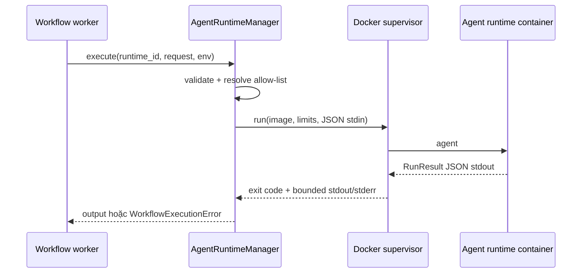

# Quản lý nhiều Agent runtime

Ngày cập nhật: **05/10/2026**. Trạng thái: **thiết kế mục tiêu cho lát cắt triển khai hiện tại**.

## 1. Mục tiêu

AgentFlow cho phép tích hợp nhiều Agent runtime độc lập. Mỗi runtime có source, dependency và image container riêng; workflow chọn runtime theo từng node thay vì buộc toàn bộ stack dùng chung một image.

Lát cắt này cung cấp:

- quy ước thư mục `src/agents/<runtime-id>`;
- manifest `runtime.json` để discover, validate và build image;
- lệnh quản lý để liệt kê, kiểm tra và build một hoặc tất cả runtime;
- `AgentRuntimeManager` trong worker để chọn runtime từ catalog allow-list, gửi request JSON qua `stdin` và nhận result JSON qua `stdout`;
- tương thích workflow cũ: giá trị `runtime: "agent"` được ánh xạ sang runtime mặc định.

Lát cắt này chưa cung cấp cài runtime từ repository bên ngoài, hot reload image, session dài hạn, streaming, approval giữa turn hoặc build image từ API. Build là thao tác quản trị/deploy, không chạy từ request của người dùng.

## 2. Cấu trúc thư mục

```text
src/agents/
├── manage.py
├── default/
│   ├── runtime.json
│   ├── Dockerfile
│   ├── pyproject.toml
│   ├── uv.lock
│   ├── src/
│   └── tests/
└── <runtime-id>/
    ├── runtime.json
    ├── Dockerfile
    └── ...
```

`runtime-id` phải là slug chữ thường gồm `a-z`, `0-9`, `-`, bắt đầu và kết thúc bằng chữ hoặc số. Mỗi thư mục trực tiếp là một đơn vị build; runtime không được đọc source hoặc credential của runtime khác.

## 3. Manifest `runtime.json`

Manifest tối thiểu:

```json
{
  "schema_version": 1,
  "id": "default",
  "image": "agentflow-agent-default:0.1.0",
  "description": "Deep Agents/LangGraph runtime bundled with AgentFlow"
}
```

Quy tắc:

- `schema_version` hiện chỉ nhận `1`;
- `id` phải trùng tên thư mục;
- `image` là image reference đầy đủ được dùng khi build và khi khai báo catalog cho worker;
- `description` là chuỗi tùy chọn phục vụ CLI/UI;
- `Dockerfile` luôn nằm trong chính thư mục runtime; không cho manifest trỏ build context ra ngoài `src/agents`.

Manifest là metadata deploy, không chứa API key, token hoặc cấu hình model. Image nên được khóa bằng version bất biến hoặc digest trong môi trường production.

## 4. Contract container

Mọi image runtime phải cung cấp executable `agent` trên `PATH`. Supervisor chạy `agent` không có argument, truyền đúng một JSON document UTF-8 qua `stdin` và chờ đúng một JSON document trên `stdout`. Log chẩn đoán chỉ ghi vào `stderr`.

Request phiên bản hiện tại:

```json
{
  "task": "Nhiệm vụ đã render",
  "context": "{\"input\":\"serialized JSON\"}",
  "skills": [],
  "output_schema": {"type": "object"}
}
```

Kết quả thành công:

```json
{
  "run_id": "runtime-generated-id",
  "status": "succeeded",
  "mode": "live",
  "output": {}
}
```

Kết quả lỗi public dùng `{ "error": { "code": "...", "message": "..." } }` và exit code khác `0`. Supervisor giới hạn kích thước request/output, timeout, CPU, memory, PID, network và chỉ chấp nhận các error code đã allow-list.

## 5. Build và catalog deploy

Lệnh quản lý chạy từ repository root:

```powershell
python src/agents/manage.py list
python src/agents/manage.py validate
python src/agents/manage.py build default
python src/agents/manage.py build --all
```

`build` gọi Docker với argument dạng mảng, dùng thư mục runtime làm build context và tag từ manifest. Tên runtime luôn được validate trước khi dùng; CLI không ghép input người dùng thành shell command.

Worker không tự quét filesystem và không tự build image. Nó chỉ chạy catalog do operator cấp:

```dotenv
AGENT_RUNTIME_DEFAULT=default
AGENT_RUNTIME_IMAGES={"default":"agentflow-agent-default:0.1.0"}
```

Catalog là allow-list. Node yêu cầu runtime không có trong catalog phải fail trước khi Docker được gọi. Cách này tách quyền build/publish image khỏi quyền thực thi workflow và tránh để graph tùy ý chọn image reference.

## 6. Chọn runtime trong workflow

Agent node lưu runtime id trong `config.runtime`:

```json
{
  "type": "agent",
  "config": {
    "runtime": "default",
    "providerId": "...",
    "model": "..."
  }
}
```

Các giá trị có ý nghĩa đặc biệt:

- `direct`: đường tương thích gọi provider trực tiếp trong worker, không chạy Agent container;
- `agent`: alias cũ, được resolve thành `AGENT_RUNTIME_DEFAULT`;
- một runtime id hợp lệ: chọn đúng entry trong `AGENT_RUNTIME_IMAGES`.

Validation của workflow chỉ kiểm tra định dạng runtime id vì catalog thuộc cấu hình deploy và có thể khác giữa control plane với worker. Worker chịu trách nhiệm kiểm tra runtime có được đăng ký trước khi thực thi.

## 7. `AgentRuntimeManager`

Worker chỉ tương tác với runtime qua một lớp:

```python
class AgentRuntimeManager:
    def available_runtime_ids(self) -> tuple[str, ...]: ...
    def resolve(self, runtime_id: str) -> AgentRuntimeDefinition: ...
    async def execute(
        self,
        runtime_id: str,
        request: dict[str, Any],
        *,
        environment_overrides: dict[str, str] | None = None,
    ) -> dict[str, Any]: ...
```

Luồng gọi:



Manager dùng chung semaphore giới hạn tổng số container. Mỗi invocation tạo container mới và luôn cleanup khi thành công, lỗi, timeout hoặc cancellation. Credential chỉ tồn tại trong environment của invocation và không được đưa vào request, graph hay log.

## 8. Tiêu chí hoàn thành

1. `manage.py validate` phát hiện manifest sai, id trùng/sai thư mục và thiếu Dockerfile.
2. `manage.py build <id>` build đúng context và image tag; runtime không đăng ký bị từ chối.
3. `AgentRuntimeManager` resolve alias `agent`, chọn image theo runtime id và không nhận image trực tiếp từ graph.
4. Hai node trong cùng một deployment có thể chọn hai runtime id khác nhau nếu cả hai có trong catalog.
5. Test xác nhận request/response, giới hạn bảo mật, runtime không tồn tại, catalog sai và tương thích `runtime: "agent"`.
6. Tài liệu local/Compose mô tả rõ bước build image và cấu hình catalog.
