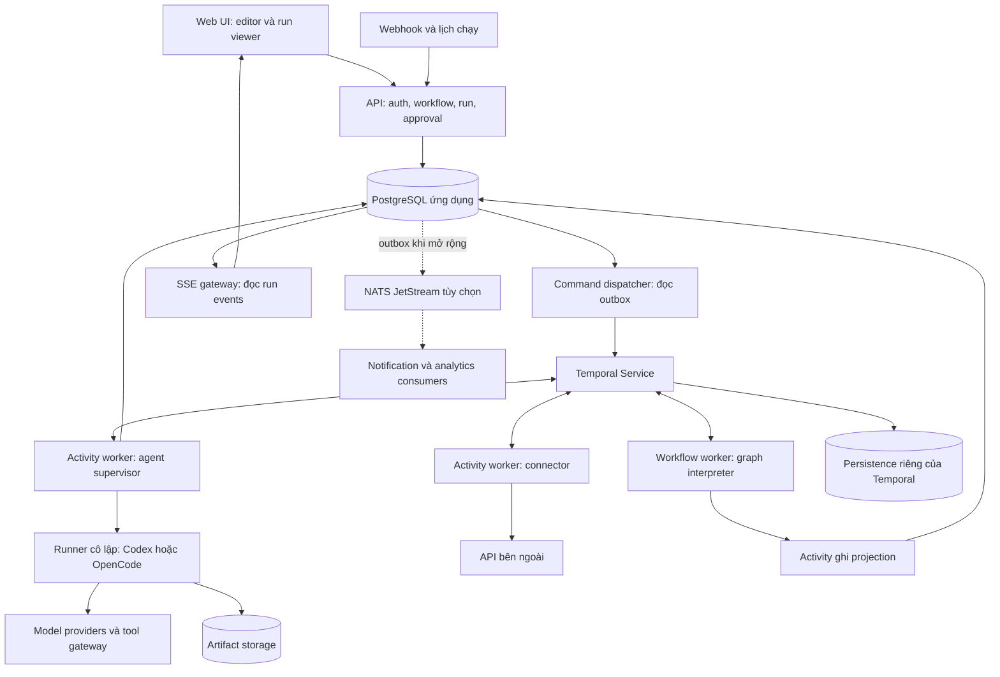

# Kiến trúc và công nghệ AgentFlow

Ngày nghiên cứu: **05/09/2026**. Trạng thái: **đề xuất để bắt đầu triển khai**.

**Điều chỉnh phạm vi PoC:** bắt đầu bằng [agent Python dùng Deep Agents/LangGraph](../src/agent/README.md), có CLI/HTTP và output JSON, để kiểm chứng ranh giới flow–agent. Stack dưới đây là kiến trúc đích; Codex/OpenCode được bổ sung sau. Python chỉ nằm ở runtime mẫu, chưa thay đổi lựa chọn TypeScript cho editor/API/engine dự kiến.

## 1. Mục tiêu và giả định

AgentFlow giúp người dùng ghép công việc thành một đồ thị trực quan: nhận webhook, gọi API, biến đổi dữ liệu, chạy agent, chạy test, chờ người duyệt và chuyển kết quả sang hệ thống khác. Coding agent được quản lý như một tài nguyên thực thi có session, workspace, quyền công cụ và giới hạn chi phí.

Giả định để lựa chọn kiến trúc:

- Bắt đầu bằng bản self-hosted cho một nhóm; thiết kế dữ liệu có tenant/project để mở rộng sau.
- Nhóm phát triển quen TypeScript; giao diện dùng trình duyệt; runner production ưu tiên Linux.
- Tác vụ agent có thể kéo dài nhiều phút; bước duyệt có thể kéo dài nhiều ngày.
- Ưu tiên khôi phục công việc, quan sát tiến độ và kiểm soát tác động bên ngoài hơn tối ưu độ trễ dưới mili giây.
- MVP xử lý JSON và artifact; chưa cần marketplace, cộng tác chỉnh sửa thời gian thực hoặc tương thích mọi workflow n8n.

Đây là giả định thiết kế, cần điều chỉnh khi có số người dùng, tải thực tế và yêu cầu triển khai cụ thể.

## 2. Khác biệt sản phẩm nên tập trung

Không nên định vị AgentFlow chỉ là “workflow có AI”. n8n đã có khả năng dùng người duyệt cho tool call của AI Agent, chẳng hạn qua Gmail. Trọng tâm đề xuất cho AgentFlow là quản lý vòng đời coding agent: workspace, diff, test, session, hủy tác vụ và chuyển giao giữa các runtime. Nguồn đối chiếu: [n8n Gmail — Human-in-the-loop for AI tool calls](https://docs.n8n.io/integrations/builtin/app-nodes/n8n-nodes-base.gmail/message-operations/).

| Khái niệm | Ý nghĩa trong AgentFlow |
| --- | --- |
| Workflow | Định nghĩa đồ thị có phiên bản |
| Run | Một lần chạy workflow với input và quyền đã xác định |
| Node execution | Một lần kích hoạt node; chứa một hoặc nhiều attempt |
| LLM node | Gửi input tới model, nhận output; thường không cần repo hoặc shell |
| Agent node | Chạy một runtime có vòng lặp tự quyết định tool call và quản lý ngữ cảnh |
| Connector node | Thao tác cụ thể với hệ thống bên ngoài, có schema và credential rõ ràng |
| Workspace | Bản checkout/snapshot dùng cho công việc, tách biệt theo run |
| Artifact | Diff, báo cáo, file đầu ra hoặc test log được lưu và tham chiếu bằng ID |

## 3. Stack đề xuất

Các lựa chọn trong bảng là quyết định thiết kế của AgentFlow, không phải yêu cầu bắt buộc của các công cụ.

| Lớp | Chọn cho MVP | Lý do và giới hạn |
| --- | --- | --- |
| Ngôn ngữ, monorepo | TypeScript, Node.js LTS được SDK hỗ trợ, pnpm workspaces | Chia sẻ schema giữa UI, API và adapter; khóa phiên bản khi làm PoC |
| Giao diện | React + Vite + React Flow | Phù hợp canvas node/edge; execution engine vẫn phải viết phía server |
| UI state | Zustand cho canvas; TanStack Query cho dữ liệu server | Tách trạng thái chỉnh sửa khỏi trạng thái run |
| API | NestJS, REST và SSE | Chia module workflow, run, credential, approval; SSE đẩy tiến độ một chiều |
| Schema | JSON Schema + Ajv ở ranh giới node | Validate cấu hình, input, output; schema dùng được ngoài TypeScript |
| Workflow engine | Temporal + TypeScript SDK | Lưu lịch sử, điều phối bước dài, timer, signal và retry |
| Database ứng dụng | PostgreSQL + Drizzle ORM | Transaction, khóa duy nhất, JSONB, migration; SQL rõ ở phần outbox |
| Artifact storage | S3 hoặc storage tương thích S3 | Lưu diff/log/file lớn; MVP local có thể dùng volume qua cùng interface |
| Agent runtime | Codex adapter; OpenCode adapter | Cô lập API riêng của mỗi nhà cung cấp |
| Runner | Container Linux cho môi trường nội bộ; đánh giá gVisor cho workload không tin cậy | Tách shell và repository code khỏi API/control plane |
| Quan sát | OpenTelemetry, structured logs; Prometheus/Grafana khi triển khai | Theo dõi trace, chi phí, thời gian chờ và lỗi |
| Đăng nhập | OIDC với nhà cung cấp danh tính của nhóm | Không tự xây hệ thống mật khẩu; RBAC theo project |
| Broker ngoài | Chưa dùng trong MVP | Thêm NATS JetStream khi cần nhiều consumer độc lập |

React Flow cung cấp biểu diễn JSON của nodes, edges và viewport; AgentFlow sẽ chuyển phần ngữ nghĩa sang DSL riêng, không lấy trạng thái canvas làm toàn bộ hợp đồng thực thi. Nguồn: [ReactFlowJsonObject](https://reactflow.dev/api-reference/types/react-flow-json-object).

OpenTelemetry cung cấp các thành phần tạo, thu thập và xuất telemetry; backend lưu trữ/dashboard là lựa chọn triển khai riêng. Nguồn: [What is OpenTelemetry?](https://opentelemetry.io/docs/what-is-opentelemetry/).

## 4. Sơ đồ hệ thống

Các khối là trách nhiệm logic; MVP triển khai **modular monolith cho API và một số worker process**, không cần mỗi khối là một microservice. Agent chạy tách process/container từ đầu vì có shell và truy cập filesystem.

Temporal Service lưu trạng thái, history và task queues; code Workflow/Activity của AgentFlow chạy trong worker. Không coi Temporal là nơi trực tiếp chạy binary Codex.

## 5. Ai sở hữu trạng thái nào?

| Dữ liệu | Nguồn có thẩm quyền | Cách sử dụng |
| --- | --- | --- |
| Workflow draft/version, membership, credential metadata | PostgreSQL ứng dụng | API đọc/ghi theo phân quyền |
| Ý định bắt đầu/hủy/duyệt | Command log + outbox ứng dụng | Lưu trước khi trả xác nhận nhận lệnh |
| Quyết định điều phối, timer, kết quả Activity đã ghi nhận | Temporal history | Workflow worker phục hồi qua replay |
| Danh sách run/node status cho UI | Projection trong PostgreSQL | Có thể trễ; không tự quyết định node tiếp theo |
| Session agent và trạng thái job trên runner | Session store/runner registry | Adapter truy vấn để reattach hoặc reconcile |
| File và snapshot | Artifact storage | Immutable, checksum, ACL theo tenant/project |
| Domain event | Run event log và outbox | Phát cho UI/integration; không thay thế Temporal history |

PostgreSQL ứng dụng và Temporal có thể cùng một máy database ở môi trường nhỏ nhưng phải tách database/user; ứng dụng không truy vấn hoặc sửa bảng nội bộ Temporal.

Để không có hai bộ điều phối, chỉ Workflow worker quyết định node nào được chạy tiếp. Một consumer của `node.completed` không được tự khởi chạy downstream node. Nó chỉ cập nhật thông báo hoặc dữ liệu phục vụ truy vấn.

## 6. Vì sao chọn Temporal?

Temporal hỗ trợ khôi phục Workflow Execution bằng history và replay. Hoạt động với bên ngoài được biểu diễn qua Activities. Điều này phù hợp với flow có bước dài và chờ sự kiện. Nguồn: [Temporal Workflow Execution](https://docs.temporal.io/workflow-execution).

| Phương án | Khi phù hợp | Công việc AgentFlow vẫn phải làm |
| --- | --- | --- |
| Temporal — đề xuất | Khôi phục, chờ duyệt dài, nhiều bước có retry | Graph interpreter, adapter, projection, idempotency và vận hành Temporal |
| BullMQ + PostgreSQL | Demo nhỏ, task nền đơn giản, đội ngũ chấp nhận tự viết engine | State machine, scheduler, join, recovery, approval, versioning |
| Broker + state machine tự viết | Có yêu cầu chuyên biệt và đội vận hành hệ phân tán | Phần lớn cơ chế durable orchestration và công cụ debug |
| LangGraph | Tự xây vòng lặp agent, memory/checkpoint, subgraph AI | Tích hợp với workflow nghiệp vụ, connector và quyền project |

BullMQ là thư viện job queue dựa trên Redis; khả năng queue và flow dependency không tự hoàn thành đặc tả sản phẩm của AgentFlow. Nguồn: [BullMQ](https://docs.bullmq.io/). LangGraph có persistence/checkpoint; có thể bổ sung dưới một loại agent node khi cần tự xây agent, chưa cần bọc Codex/OpenCode bằng LangGraph trong MVP. Nguồn: [LangGraph persistence](https://docs.langchain.com/oss/python/langgraph/persistence).

Lựa chọn Temporal đổi chi phí tự xây engine lấy chi phí học và vận hành nền tảng. Nếu mục tiêu chỉ là demo một flow ngắn, BullMQ là phương án nhẹ hơn. Với giả định có tác vụ dài và chờ duyệt, nên PoC Temporal trước và dùng một engine duy nhất cho MVP.

## 7. Mô hình dữ liệu tối thiểu

| Bảng | Trường/ràng buộc chính |
| --- | --- |
| `tenants`, `projects`, `memberships` | Phân quyền theo tenant/project/user |
| `workflows` | Draft JSON, revision để optimistic locking |
| `workflow_versions` | Workflow ID, version, graph JSON, content hash; immutable |
| `runs` | Tenant, version ID, input ref, logical run ID, Temporal workflow ID, status projection, projection sequence |
| `node_executions` | Run ID, node ID, invocation ID, input/output refs, trạng thái |
| `node_attempts` | Execution ID, attempt, error class, start/end, lease generation |
| `agent_sessions` | Execution ID, provider, runtime version, session ID, workspace ref, runner ID |
| `runner_jobs` | Operation key duy nhất, lease, generation, trạng thái, result manifest |
| `approval_requests` | Request ID, action hash, reviewer scope, expiry, decision, trạng thái applied |
| `commands`, `outbox` | Idempotency key, loại lệnh/event, payload ref, số lần gửi, lần thử tiếp |
| `run_events`, `consumer_inbox` | Event ID duy nhất; inbox khóa theo consumer + event ID |
| `artifacts` | Object key, checksum, loại nội dung, dung lượng, retention |
| `credentials` | Secret reference, provider, owner/project; không trả secret cho UI |
| `usage_records` | Operation/attempt, provider, tokens, cost estimate, pricing version |

Mọi truy vấn artifact, event, credential và session đều phải kiểm tra tenant/project; UUID khó đoán không phải cơ chế phân quyền. PostgreSQL row-level security có thể là lớp bảo vệ bổ sung, nhưng role chủ bảng hoặc có `BYPASSRLS` có ngoại lệ nên phải chọn role ứng dụng phù hợp. Nguồn: [PostgreSQL Row Security Policies](https://www.postgresql.org/docs/current/ddl-rowsecurity.html).

## 8. Quyết định trì hoãn

- Chưa dùng Kafka, Elasticsearch hoặc vector database riêng khi chưa có tải/use case chứng minh cần.
- Chưa cần Kubernetes cho bản chạy nội bộ đầu tiên; bổ sung khi phải quản lý nhiều runner hoặc cần HA.
- MCP dành cho kết nối tool/context; không dùng làm workflow database hay task queue.
- Chưa tự động chuyển runtime khi agent đang chạy. Đổi Codex sang OpenCode là một execution mới với input chuẩn hóa và artifact bàn giao.
- Việc phát triển sản phẩm độc lập hoặc mở rộng n8n cần đánh giá riêng về UX, nhu cầu tương thích và giấy phép trước khi tái sử dụng mã nguồn. Tài liệu này đề xuất sản phẩm độc lập và không dựa vào việc sao chép engine n8n.

Chi tiết tiếp theo: [event-driven](event-driven.md), [agent adapter](agent-integration.md), [workflow DSL](workflow-spec.md), [lộ trình](roadmap.md).
