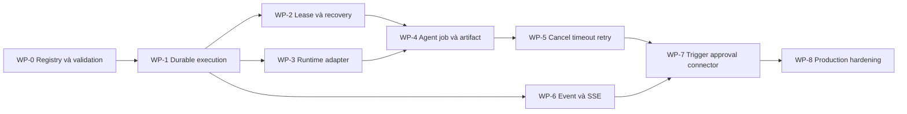

# Kế hoạch bổ sung lõi workflow và Agent Runtime

Ngày lập: **03/10/2026**. Trạng thái: **đang triển khai**.

Tài liệu này chuyển các khoảng trống của PoC hiện tại thành thứ tự công việc có thể triển khai và nghiệm thu. Nó không thay thế các tài liệu thiết kế chi tiết:

- [Đặc tả workflow](workflow-spec.md)
- [Lưu trữ và thực thi workflow](workflow-execution.md)
- [Agent runtime dùng một lần](ephemeral-agent-runtime.md)
- [Thiết kế event-driven](event-driven.md)

## 1. Mục tiêu

Sau khi hoàn thành các mốc bắt buộc, AgentFlow phải bảo đảm:

1. Một run đã được nhận bền vững không bị mất khi API, worker hoặc runner restart.
2. Redis redelivery không âm thầm chạy lại cùng một agent attempt hoặc side effect.
3. Mỗi Agent node chọn một runtime có contract, capability và phiên bản rõ ràng.
4. Run có thể bị hủy; deadline và retry không bị reset khi worker restart.
5. Workspace, result và artifact cần thiết vẫn tồn tại sau khi container bị xóa.
6. Workflow không hợp lệ bị từ chối khi publish, thay vì chỉ lỗi lúc worker chạy.
7. UI có thể theo dõi tiến độ và phục hồi sau khi mất kết nối.

## 2. Phạm vi và mức ưu tiên

### P0 — điều kiện để chạy agent an toàn

- Node attempt bền vững, operation key và state machine.
- Lease, heartbeat, fencing và recovery theo step.
- Runtime adapter/registry và capability validation.
- Deadline, cancellation và retry policy.
- Result manifest, workspace snapshot và artifact store tối thiểu.

### P1 — workflow sử dụng được trong thực tế

- Node registry dùng chung cho validator, engine và UI.
- HTTP/Webhook, Approval và connector đầu tiên.
- Run events, SSE reconnect và log/artifact API.
- JSON Schema validator đầy đủ.

### P2 — vận hành production

- Quota và backpressure theo owner/provider/runtime.
- Usage/cost, OpenTelemetry, metric và alert.
- Runner tách khỏi Docker socket của workflow worker.
- Project RBAC, retention, backup/restore và audit mở rộng.

Không triển khai Map, loop, subflow, marketplace hoặc collaborative editing trước khi P0 hoàn tất.

## 3. Các bất biến bắt buộc

Các thay đổi phía dưới phải giữ những bất biến sau:

- `workflow_versions.graph` là snapshot bất biến của cấu hình thực thi.
- Mỗi logical node execution có một `operation_key` ổn định qua redelivery.
- Retry chủ động tạo `attempt` mới; redelivery cùng attempt không tạo job/container mới.
- Chỉ lease owner có đúng `lease_generation` mới được commit heartbeat hoặc kết quả.
- Kết quả và artifact manifest được commit trước khi container/workspace tạm bị xóa.
- Run terminal không được quay lại `running` vì event đến muộn.
- Cancel intent được commit trước khi gửi tín hiệu dừng cho runner.
- Side effect bên ngoài không được retry nếu trạng thái kết quả còn mơ hồ.
- Secret không xuất hiện trong graph snapshot, command payload, event, argv hoặc log mặc định.

## 4. Thứ tự triển khai



WP-0 nên làm trước vì hiện validator có thể chấp nhận node mà engine không hỗ trợ. WP-1 đến WP-5 là đường găng trước khi thêm runtime Codex/OpenCode hoặc connector có side effect.

### Trạng thái thực hiện

| Work package | Trạng thái | Ghi chú |
| --- | --- | --- |
| WP-0 | Hoàn thành lát cắt đầu tiên ngày 03/10/2026 | Registry server-side, API `/v1/node-types`, version pinning khi publish, validation node/version/binding và editor/planner dùng catalog thực thi |
| WP-1 | Đang triển khai | Đã thêm schema/migration nền cho `node_attempts`, `run_commands`, `run_events`; worker dual-write và recovery thuộc PR tiếp theo |
| WP-2 đến WP-8 | Chưa bắt đầu | Thực hiện theo dependency ở trên |

## 5. Work package chi tiết

### WP-0 — Node registry và validation thống nhất

**Kết quả cần có**

- Một registry phía server định nghĩa cho mỗi node:
  - `type`, `typeVersion`;
  - config/input/output JSON Schema;
  - control ports;
  - executor key;
  - side-effect class;
  - capability và credential requirements.
- Validator từ chối graph rỗng, node không hỗ trợ, version không hỗ trợ, binding sai và port sai.
- Agent planner chỉ được đề xuất node có trong catalog thực thi.
- UI lấy metadata từ API hoặc generated schema thay vì duy trì danh sách độc lập.

**API đề xuất**

```text
GET /v1/node-types
```

**Tiêu chí nghiệm thu**

- Publish graph có `http.request` khi executor chưa đăng ký phải trả `422`.
- Publish graph rỗng hoặc binding tới output không tồn tại phải trả `422`.
- Mọi workflow đã publish đều có thể được engine nhận mà không lỗi `unsupported node type`.
- Contract test so sánh node catalog của API, editor và agent planner.

### WP-1 — Durable execution ledger

Giữ `run_steps` làm node execution projection trong giai đoạn đầu và thêm các bảng sau.

#### `node_attempts`

| Trường | Yêu cầu |
| --- | --- |
| `id`, `run_step_id`, `attempt` | Unique theo `(run_step_id, attempt)` |
| `operation_key` | Unique, ổn định cho một attempt |
| `status` | `queued`, `running`, `succeeded`, `failed`, `timed_out`, `cancelled`, `unknown` |
| `input_hash`, `config_hash` | Kiểm tra provenance |
| `error_code`, `error` | Lỗi chuẩn hóa, không chứa secret |
| `started_at`, `completed_at`, `deadline_at` | Deadline tuyệt đối |
| `result_ref`, `usage` | Reference tới manifest và usage |

#### `run_commands`

| Trường | Yêu cầu |
| --- | --- |
| `id`, `run_id`, `type` | `start`, `cancel`, `approval_decision` |
| `idempotency_key`, `payload_hash` | Unique theo owner/scope |
| `status` | `accepted`, `applied`, `rejected` |
| `created_at`, `applied_at` | Audit command |

#### `run_events`

| Trường | Yêu cầu |
| --- | --- |
| `id`, `run_id`, `sequence` | Sequence tăng đơn điệu theo run |
| `type`, `payload` | Lifecycle payload nhỏ, đã che dữ liệu nhạy cảm |
| `created_at` | Dùng cho retention và SSE replay |

**Thay đổi worker**

- Không dựng lại mọi step ở trạng thái `pending` khi reclaim run.
- Nạp các step/attempt đã terminal và chỉ schedule step chưa hoàn tất.
- Commit step transition và `run_event` trong cùng transaction.
- Dùng compare-and-set để ngăn terminal state bị ghi đè.

**Tiêu chí nghiệm thu**

- Crash sau khi một node thành công không làm node đó chạy lại.
- Hai worker nhận cùng run chỉ có một worker được phép tạo attempt.
- Event đến muộn không đổi run `succeeded` về `running`.

### WP-2 — Lease, heartbeat, fencing và reconciliation

Thêm ownership có thời hạn cho workflow execution và agent job:

```text
lease_owner
lease_expires_at
lease_generation
heartbeat_at
```

**Quy tắc**

- Claim tăng `lease_generation` trong transaction.
- Mọi update sau claim phải có điều kiện `lease_generation = expected`.
- Worker gia hạn lease trong lúc chạy node dài.
- Redis `XAUTOCLAIM` chỉ chuyển quyền đọc message; database lease mới quyết định quyền ghi.
- Reconciler kiểm tra run/job hết lease và chuyển sang `unknown`, resume hoặc retry theo policy.

**Tiêu chí nghiệm thu**

- Worker cũ không thể ghi kết quả sau khi mất lease.
- Agent chạy lâu hơn `WORKFLOW_RECLAIM_IDLE_MS` không tạo execution thứ hai.
- Kill worker ở trước/sau mỗi commit boundary đều cho kết quả xác định.

### WP-3 — Agent Runtime Adapter contract

Tạo interface độc lập với Docker và provider cụ thể:

```python
class AgentRuntimeAdapter(Protocol):
    runtime_type: str
    contract_version: str

    async def capabilities(self) -> RuntimeCapabilities: ...
    async def start(self, request: AgentJobRequest) -> AgentJobHandle: ...
    async def inspect(self, handle: AgentJobHandle) -> AgentJobState: ...
    async def cancel(self, handle: AgentJobHandle) -> None: ...
    async def collect(self, handle: AgentJobHandle) -> AgentResultManifest: ...
```

`RuntimeCapabilities` tối thiểu gồm:

- `tools`, `mcp`, `shell`, `workspace_write`;
- `session_resume`, `streaming`, `interactive_approval`;
- loại input/output và artifact hỗ trợ;
- network/resource profiles được phép.

`AgentJobRequest` tối thiểu gồm:

- `job_id`, `operation_key`, `contract_version`;
- task/context và output schema;
- runtime type, image digest/version;
- workspace/artifact references;
- deadline và resource/network policy;
- references tới credential đã được authorize.

`AgentResultManifest` tối thiểu gồm:

- `job_id`, `operation_key`, status và error code;
- structured output reference/checksum;
- artifact references/checksums;
- usage, runtime version và timestamps.

**Adapter đầu tiên**

1. Bọc runtime Deep Agents hiện tại thành `deepagents-container-v1`.
2. Giữ `direct` là LLM node compatibility path, không coi là agent runtime đầy đủ.
3. Chỉ thêm Codex/OpenCode sau khi contract test của adapter đầu tiên đạt.

**Tiêu chí nghiệm thu**

- Publish thất bại nếu node yêu cầu capability runtime không có.
- Workflow version snapshot runtime type, contract version và image digest.
- Thay tag image mặc định không làm thay runtime của version cũ.
- Mỗi adapter chạy cùng một bộ contract tests.

### WP-4 — Agent job, workspace và artifact

Thêm `agent_jobs` và `artifacts`; agent job phải đi qua queue riêng thay vì workflow worker giữ Docker process trong suốt execution.

#### `agent_jobs`

- FK tới `node_attempts` và unique `operation_key`.
- Runtime type, contract version, image digest.
- State, runner, lease và container reference nội bộ.
- Result reference, termination reason và cleanup state.

#### `artifacts`

- Owner/run/step/attempt scope.
- Object key, content type, size, checksum.
- Kind: `result`, `log`, `diff`, `workspace_snapshot`, `report`.
- Retention, created time và immutable/finalized state.

**MVP storage**

- Định nghĩa `ArtifactStore` interface.
- Có local-volume implementation cho development.
- Không ghi đường dẫn host trực tiếp vào public contract.
- Áp dụng size limit và checksum trước khi finalize.

**Tiêu chí nghiệm thu**

- Runner chết sau khi upload result nhưng trước terminal commit có thể reconcile manifest mà không gọi model lại.
- Container bị xóa nhưng output/diff/log đã finalize vẫn tải được theo ACL.
- Hai attempt không dùng chung writable workspace.
- Artifact sai checksum không được dùng làm node output.

### WP-5 — Deadline, cancellation và retry policy

**API đề xuất**

```text
POST /v1/runs/{runId}/cancel
GET  /v1/commands/{commandId}
```

Request thay đổi trạng thái phải nhận `Idempotency-Key`.

**Retry policy tối thiểu**

```json
{
  "maxAttempts": 3,
  "initialBackoffSeconds": 2,
  "maxBackoffSeconds": 30,
  "retryableCodes": ["PROVIDER_OVERLOADED", "RATE_LIMITED", "PROVIDER_UNAVAILABLE"]
}
```

**Quy tắc**

- Deadline là timestamp tuyệt đối được snapshot khi tạo run/attempt.
- Retry không reset deadline hoặc budget.
- Auth, schema, policy và invalid input không retry tự động.
- Side effect timeout không rõ kết quả chuyển `reconciliation_required`.
- Cancel ngừng schedule node mới, cancel job đang chạy, chờ cleanup rồi mới terminal.

**Tiêu chí nghiệm thu**

- Gửi cancel hai lần trả cùng command/result.
- Cancel container đang chạy dừng process tree và cleanup resource.
- Provider 429 retry đúng số lần và giữ cùng logical execution.
- Worker restart giữa backoff không làm mất lịch retry.

### WP-6 — Event stream, log và run viewer

**API đề xuất**

```text
GET /v1/runs/{runId}/events
GET /v1/runs/{runId}/stream
GET /v1/artifacts/{artifactId}/download
```

SSE hỗ trợ `Last-Event-ID`; nếu cursor hết retention, server yêu cầu client tải lại snapshot. Không đưa từng token vào database event log; token delta có thể dùng kênh ngắn hạn và bị giới hạn.

**Tiêu chí nghiệm thu**

- Reload UI hiển thị lại đầy đủ lifecycle từ projection.
- Mất kết nối SSE rồi reconnect không bỏ sót lifecycle event.
- User khác không đọc được event/log/artifact dù biết UUID.

### WP-7 — Trigger, Approval và connector đầu tiên

Triển khai theo thứ tự:

1. HTTP Request dạng read-only, có timeout và response size limit.
2. Webhook trigger có signature/timestamp validation và delivery dedup.
3. Approval node có action hash, reviewer scope và expiry.
4. Một connector external-write, khuyến nghị GitHub draft pull request.

**API đề xuất**

```text
POST /v1/webhooks/{triggerId}
POST /v1/approvals/{requestId}/decisions
```

**Tiêu chí nghiệm thu**

- Cùng webhook delivery ID chỉ tạo một logical run.
- Hai quyết định approval đồng thời chỉ có một quyết định được áp dụng.
- Artifact/action hash thay đổi làm approval cũ mất hiệu lực.
- Connector timeout sau request phải reconcile trước khi retry.
- Deny hoặc expiry không tạo side effect.

### WP-8 — Production hardening

- Tách Agent Runner Supervisor khỏi workflow worker.
- Không mount Docker socket vào worker xử lý orchestration.
- Egress allowlist/proxy; chặn metadata và control-plane network.
- Secret ngắn hạn hoặc broker/proxy thay vì API key dài hạn trong container.
- Quota backlog, concurrent jobs, CPU/RAM/PID/disk/output theo owner/runtime/provider.
- OpenTelemetry trace; metric queue age, lease age, attempt, retry, cleanup, token/cost.
- Backup/restore database và artifact metadata/data.
- Retention và xóa dữ liệu bao phủ database, artifacts, logs và runtime sessions.

## 6. Trạng thái run và step đề xuất

### Run

```text
pending -> running -> waiting_approval -> running
   |          |              |
   +----------+--------------+-> cancelling -> cancelled
   +----------+--------------+-> failed
   +----------+--------------+-> timed_out
   `---------------------------> succeeded
```

### Step/attempt

```text
pending -> queued -> running -> succeeded
                     |  |  |
                     |  |  +-> failed
                     |  +----> timed_out
                     +-------> cancelled
                     `-------> unknown -> reconciliation_required
```

Mỗi transition phải có compare-and-set hợp lệ; không cập nhật bằng chuỗi status tự do.

## 7. Chiến lược migration

1. Thêm bảng/column mới mà chưa đổi đường chạy hiện tại.
2. Dual-write `run_steps` và `run_events` dưới feature flag.
3. Chuyển Agent node sang `agent_jobs` với adapter Deep Agents.
4. Bật lease/fencing và recovery cho một worker canary.
5. Bật cancel/retry và SSE.
6. Xóa đường chạy container trực tiếp khỏi workflow worker sau khi fault-injection đạt.

Feature flags đề xuất:

```dotenv
DURABLE_NODE_ATTEMPTS_ENABLED=false
AGENT_JOB_RUNNER_ENABLED=false
RUN_EVENTS_ENABLED=false
SSE_ENABLED=false
```

Không giữ hai orchestrator có quyền quyết định downstream node cùng lúc. Feature flag chỉ chọn implementation; mỗi run phải được pin vào một execution mode ngay khi tạo.

## 8. Kiểm thử bắt buộc

### Unit và contract

- Node registry/graph/schema validation.
- Runtime adapter contract cho success, invalid output, timeout và cancel.
- State transition và retry classification.
- Operation key và payload hash ổn định.

### Integration

- PostgreSQL thật cho claim/lease/fencing và concurrent approval.
- Redis thật cho duplicate delivery, pending reclaim và stream restart.
- Docker thật cho timeout, cancel, OOM, cleanup và orphan reconciliation.
- Artifact store thật cho finalize/checksum/ACL.

### Fault injection

Kill process tại các điểm:

1. Sau DB commit, trước enqueue.
2. Sau enqueue, trước ACK outbox.
3. Sau claim, trước start container.
4. Sau container start, trước lưu container reference.
5. Sau result upload, trước terminal commit.
6. Sau terminal commit, trước queue ACK và cleanup.

Không đóng P0 nếu chưa chứng minh các điểm trên không làm mất run hoặc nhân đôi side effect.

## 9. Definition of Done cho lõi MVP

Lõi MVP hoàn thành khi tất cả điều kiện sau đúng:

- Redelivery cùng operation key không tạo attempt/container thứ hai.
- Worker hoặc runner restart có thể resume/reconcile từ dữ liệu bền vững.
- Cancel và deadline hoạt động qua restart.
- Runtime được pin bằng type, contract version và image digest.
- Agent result, log và artifact tồn tại độc lập với container.
- Validator từ chối mọi node/config/binding mà engine không hỗ trợ.
- UI reconnect được và đọc lịch sử run theo ACL.
- Có integration test và fault-injection cho đường thực thi chính.
- Coding agent không có credential external-write trực tiếp; side effect đi qua connector được kiểm soát.

## 10. Backlog khởi đầu đề xuất

Các pull request đầu tiên nên nhỏ và theo thứ tự:

1. **PR-1 — đã triển khai trong working tree:** node registry server-side; từ chối graph rỗng và unsupported node.
2. **PR-2 — đã triển khai trong working tree:** migration `node_attempts`, `run_commands`, `run_events` và state enums.
3. **PR-3:** operation key, transactional transitions và event projection.
4. **PR-4:** lease generation, heartbeat và worker recovery từ step đã lưu.
5. **PR-5:** runtime adapter contract và adapter `deepagents-container-v1`.
6. **PR-6:** `agent_jobs`, queue riêng và runner supervisor local.
7. **PR-7:** artifact store local, result manifest và reconciliation.
8. **PR-8:** cancel/deadline/retry policy.
9. **PR-9:** SSE/event replay và cập nhật run viewer.
10. **PR-10:** webhook, approval và connector đầu tiên.

Mỗi PR phải kèm migration rollback phù hợp, test failure path và cập nhật tài liệu contract liên quan.
