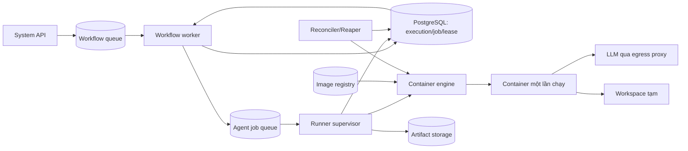
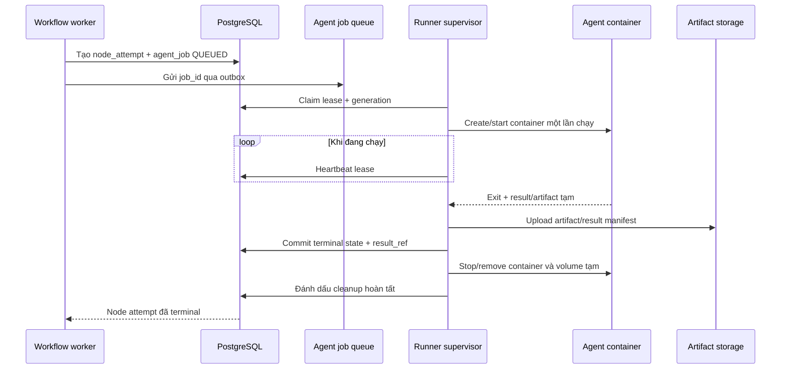

# Thiết kế agent runtime dùng một lần cho mỗi node attempt

Ngày cập nhật: **20/09/2026**. Trạng thái: **đã triển khai lát cắt M0b bằng agent trong `src/agents` trên Docker local; không dùng Codex trong đường chạy hiện tại; job/lease/reconciler bền vững vẫn thuộc các giai đoạn tiếp theo**. Phạm vi: node `agent`; node `llm.call` đơn giản tiếp tục gọi provider trực tiếp nếu không cần tool, shell hoặc workspace.

## 1. Quyết định kiến trúc

Mỗi lần thực thi một **attempt của agent node** sẽ chạy trong một container mới từ image agent đã khóa bằng digest. Container chỉ nhận một yêu cầu, trả một kết quả rồi bị dừng và xóa. Retry tạo attempt và container mới; không tái sử dụng process, graph state, filesystem ghi được hoặc model client của attempt trước.

Container là tài nguyên thực thi tạm thời, không phải nguồn trạng thái bền vững. Trạng thái job, lease, kết quả, log cần giữ và artifact phải được lưu bên ngoài container trước khi xóa.

Quyết định này thay thế đường production dùng một HTTP agent service chạy lâu dài. HTTP server trong `src/agents` có thể được giữ để phát triển và kiểm thử contract, nhưng workflow worker không gọi nó trong đường production mới.

### Vì sao chọn đơn vị “attempt”

- Một node execution có thể được retry; mỗi attempt cần môi trường sạch và nhận diện riêng.
- Cùng một workflow có thể có nhiều agent node chạy song song mà không chia sẻ memory hoặc filesystem ghi được.
- Container hỏng hoặc bị mất không làm mất trạng thái điều phối đã commit.
- Có thể đo CPU, RAM, thời gian và chi phí theo attempt.
- Có thể nâng số runner theo chiều ngang mà không đổi contract của workflow engine.

Đây không phải cam kết rằng hàng triệu node sẽ chạy đồng thời với độ trễ không đổi. Hệ thống có năng lực hữu hạn và còn phụ thuộc database, Redis, image registry, băng thông, artifact storage và giới hạn của LLM provider. Mục tiêu đúng là: nhận tải bền vững, xếp hàng có giới hạn, tạo backpressure rõ ràng và tăng throughput gần tuyến tính khi bổ sung runner trong phạm vi các nút thắt còn lại.

## 2. Hiện trạng và khoảng cách cần lấp

Repository hiện có hai đường thực thi cho Agent node:

1. `agent` là mặc định, tạo container `agentflow-agent-*` từ `src/agents/Dockerfile`, chạy CLI `agent` đúng một lần và luôn gọi provider/model thật đã cấu hình.
2. `direct` gọi LLM provider trực tiếp trong workflow-worker làm đường tương thích.

Lát cắt local hiện để workflow-worker gọi Docker Engine trực tiếp và luôn cleanup trong `finally`. Đây chưa phải mô hình production đích: vẫn cần **Agent Runner Supervisor** độc lập, job/attempt bền vững và reconciler để workflow-worker không nắm Docker socket.

## 3. Kiến trúc đích



Trách nhiệm:

| Thành phần | Trách nhiệm |
| --- | --- |
| Workflow worker | Quyết định node nào được chạy; tạo `node_attempt` và agent job; chờ kết quả bền vững; không gọi Docker |
| Agent job queue | Phân phối `job_id`, at-least-once; payload lớn chỉ truyền bằng reference |
| Runner supervisor | Claim lease, kiểm tra quota, tạo/dừng/xóa container, heartbeat, thu kết quả và artifact |
| Container agent | Thực thi đúng một request; không nhận job thứ hai; không tự ghi database control plane |
| Reconciler/Reaper | Phát hiện lease hết hạn, job/container mồ côi, hoàn tất cleanup idempotent |
| PostgreSQL | Nguồn trạng thái job/attempt có thẩm quyền |
| Artifact storage | Lưu output lớn, log, diff, test report và result manifest bất biến |

Chỉ supervisor đáng tin được truy cập Docker Engine hoặc container runtime. API, workflow-worker và container agent không được mount Docker socket.

## 4. Contract thực thi một lần

MVP nên kế thừa contract JSON của CLI trong `src/agents`, sau đó bổ sung chế độ đọc request và ghi result qua file được mount để supervisor kiểm soát kích thước và thu artifact. Không cần mở port hay health endpoint cho container chỉ chạy một job.

Lệnh logic:

```text
agent-runtime run --request /run/input/request.json --result /run/output/result.json
```

Supervisor mount các vùng riêng:

- `/run/input`: chỉ đọc, chứa request hoặc các reference đã resolve.
- `/run/output`: ghi được, có quota, chỉ dùng cho result manifest và artifact tạm.
- `/workspace`: tùy loại agent, là volume/snapshot riêng của attempt.
- Root filesystem: chỉ đọc; `/tmp` là `tmpfs` có giới hạn.

Không truyền prompt, token hoặc secret trên command line. Không ghi secret vào label, stdout, image layer hay result manifest.

### Request envelope

```json
{
  "contractVersion": "1",
  "jobId": "0195...",
  "runId": "0195...",
  "nodeExecutionId": "0195...",
  "attempt": 1,
  "operationKey": "sha256:...",
  "deadlineAt": "2026-09-20T10:30:00Z",
  "runtime": {
    "image": "registry/agentflow-agent@sha256:...",
    "kind": "deep-agent",
    "version": "0.2.0"
  },
  "input": { "task": "...", "context": "..." },
  "skills": [{ "id": "...", "version": 3, "contentHash": "...", "instructions": "..." }],
  "policy": {
    "networkProfile": "llm-only",
    "workspaceMode": "none",
    "maxOutputBytes": 1048576
  },
  "trace": { "traceparent": "..." }
}
```

Các trường có khả năng lớn như workspace snapshot hoặc file input phải dùng `artifactRef` kèm checksum, không nhét vào queue message. `operationKey` được tạo từ node execution, attempt và input/config snapshot; request trùng key phải trả cùng `job_id`, không tạo thêm container.

### Result envelope

```json
{
  "contractVersion": "1",
  "jobId": "0195...",
  "status": "succeeded",
  "output": { "summary": "..." },
  "artifacts": [
    { "name": "result.json", "mediaType": "application/json", "sha256": "...", "size": 1234 }
  ],
  "usage": { "inputTokens": 100, "outputTokens": 40 },
  "runtime": { "version": "0.2.0" }
}
```

Supervisor không tin nội dung do container khai báo. Nó phải kiểm tra schema, `jobId`, giới hạn kích thước, đường dẫn/symlink, tự tính checksum, upload artifact, sau đó tạo result manifest có reference bền vững.

Quy ước process:

| Kết quả | Exit code | Yêu cầu |
| --- | ---: | --- |
| Thành công | `0` | Có result hợp lệ và đúng `jobId` |
| Lỗi runtime/provider | `1` | Có error envelope đã che dữ liệu nhạy cảm |
| Input/contract sai | `2` | Không retry tự động |
| Process bị kill/OOM/timeout | do supervisor xác định | Không tin output dở dang |

Exit code `0` nhưng thiếu/sai result vẫn là `RESULT_INVALID`. Có file result không đồng nghĩa job thành công nếu process chưa kết thúc hợp lệ.

## 5. Vòng đời job và thứ tự commit



Thứ tự bắt buộc:

1. Commit attempt/job và outbox trước khi enqueue.
2. Runner claim bằng lease có `generation`; mọi lần ghi sau phải kèm generation để fence runner cũ.
3. Ghi `container_ref` ngay sau create để reconciler có thể tìm và dọn.
4. Thu và upload result manifest trước khi ghi `SUCCEEDED`.
5. Commit trạng thái terminal trước khi xóa container.
6. Cleanup luôn chạy trong `finally`; nếu thất bại, giữ terminal result và chuyển `cleanup_status=REQUIRED` để reaper xử lý.

Không giữ transaction database mở trong khi pull image, chạy model hoặc upload artifact.

### State machine đề xuất

Trạng thái thực thi và trạng thái cleanup được tách riêng:

```text
QUEUED -> LEASED -> PROVISIONING -> RUNNING -> COLLECTING
                                      |            |
                                      +------------+-> SUCCEEDED
                                      +------------+-> FAILED
                                      +------------+-> TIMED_OUT
                                      +------------+-> CANCELLED

cleanup_status: NOT_STARTED -> REQUIRED -> RUNNING -> CLEANED
                                             `-----> RETRY_REQUIRED
```

Container bị xóa không được dùng làm tín hiệu duy nhất rằng job đã hoàn tất. Trạng thái `UNKNOWN` hoặc `LOST` cần đối soát; không tự retry một agent có side effect nếu chưa chứng minh attempt trước chưa gây tác động.

### Session và approval

- Không lưu session cần resume chỉ trong filesystem của container. Session ID, checkpoint hoặc snapshot phải được ghi ra kho bền vững trước khi container kết thúc, và chỉ runtime khai báo capability tương ứng mới được resume trong container mới.
- MVP ưu tiên approval ở ranh giới node: agent tạo output/artifact, container đóng, sau đó workflow chờ người duyệt. Chờ duyệt nhiều giờ hoặc nhiều ngày không giữ container sống.
- Permission request giữa turn chỉ được hỗ trợ khi có deadline ngắn, event bền vững và cơ chế resume/reattach đã kiểm chứng. Nếu chưa có, runtime trả `CAPABILITY_UNSUPPORTED` thay vì treo container vô hạn hoặc tự cấp quyền.
- Prompt tiếp theo sau approval là một attempt/turn mới theo contract đã snapshot; không dựa vào memory process của container cũ.

## 6. Dữ liệu cần bổ sung

### `node_attempts`

| Trường | Ý nghĩa |
| --- | --- |
| `id`, `node_execution_id`, `attempt` | Định danh; unique theo execution + attempt |
| `operation_key` | Khóa idempotency bất biến |
| `status`, `error_code`, `error_metadata` | Kết quả chuẩn hóa |
| `input_hash`, `config_hash`, `runtime_image_digest` | Provenance của lần chạy |
| `started_at`, `completed_at`, `deadline_at` | Deadline và đo thời gian |
| `result_ref`, `usage` | Manifest và usage đã xác minh |

### `agent_jobs`

| Trường | Ý nghĩa |
| --- | --- |
| `id`, `attempt_id`, `operation_key` | Một job cho một attempt; `operation_key` unique |
| `status` | State machine provisioning/execution |
| `runner_id`, `lease_expires_at`, `lease_generation` | Ownership và fencing |
| `container_runtime`, `container_ref` | Reference nội bộ để inspect/cleanup |
| `heartbeat_at`, `exit_code`, `termination_reason` | Chẩn đoán |
| `cleanup_status`, `cleanup_attempts`, `cleaned_at` | Theo dõi dọn tài nguyên độc lập |
| `result_ref`, `created_at`, `updated_at` | Kết quả và audit |

Nên có thêm `agent_job_events` dạng append-only cho transition/audit và bảng `artifacts` như thiết kế hiện có. Không lưu container ID như public API; nó là chi tiết của runner.

## 7. Concurrency, backpressure và mở rộng

Không tạo container ngay trong vòng lặp đọc workflow queue. Agent job đi qua queue riêng để workflow-worker không bị block và runner có thể scale độc lập.

Mỗi runner công bố năng lực và chỉ claim khi còn đủ tài nguyên. Dùng giới hạn theo trọng số thay vì chỉ đếm số container, ví dụ một job yêu cầu `cpu=2`, `memory=4 GiB`, `pids=256`. Các giới hạn tối thiểu:

- Toàn cụm và theo runner.
- Theo tenant/project để tránh một người dùng chiếm hết tài nguyên.
- Theo runtime/image và network profile.
- Theo LLM provider/model để tôn trọng rate limit.
- Số job đang provisioning để tránh image pull/container create làm nghẽn host.

Khi hết năng lực, job ở `QUEUED`; API vẫn có thể nhận tới quota backlog. Khi backlog hoặc thời gian chờ vượt ngưỡng, trả lỗi quota/rate limit rõ ràng thay vì tiếp tục nhận vô hạn.

Ước lượng ban đầu bằng Little's Law:

```text
concurrency cần thiết xấp xỉ arrival_rate × thời gian chạy trung bình
```

Ví dụ 10 job/giây với thời gian trung bình 120 giây cần khoảng 1.200 slot chạy, chưa tính burst, retry và headroom. Trước khi tuyên bố quy mô hàng triệu node, phải benchmark riêng queue admission, container start, registry pull, artifact upload, database write rate và provider quota.

Hướng scale:

1. Pre-pull image theo digest trên runner; không pull cùng một image đồng thời nhiều lần.
2. Image nhỏ, dependency khóa phiên bản; không build image theo từng job.
3. Nhiều runner độc lập cùng consumer group; scheduler ưu tiên data locality khi có workspace lớn.
4. Autoscale theo queue age và resource demand, không chỉ queue length.
5. Có headroom và rate limit cho cleanup/reconciliation để tránh “retry storm”.

MVP không dùng warm container pool vì phá vỡ giả định mỗi attempt có môi trường mới. Có thể đánh giá snapshot/VM hoặc pre-created sandbox sau khi có benchmark và vẫn phải bảo đảm không tái sử dụng writable state.

## 8. Cô lập và bảo mật bắt buộc

Profile container mặc định:

- Chạy non-root với UID/GID cố định; không privileged.
- `read_only` root filesystem, `no-new-privileges`, drop toàn bộ Linux capabilities.
- Giới hạn CPU, memory, PID, thời gian, dung lượng workspace/output và file size.
- Seccomp/AppArmor/SELinux theo môi trường; cân nhắc gVisor hoặc microVM cho mã không tin cậy.
- Không mount Docker socket, home host, credential control plane hoặc volume dùng chung có quyền ghi.
- Network mặc định `none`. Job cần LLM dùng egress proxy/allowlist; chặn metadata service, private network và control-plane endpoints.
- Credential ngắn hạn, đúng scope, cấp tại biên tin cậy; ưu tiên proxy để container không giữ API key dài hạn.
- Workspace theo attempt; tuyệt đối không để hai container cùng ghi một workspace.
- Log được giới hạn tốc độ/kích thước và che secret trước khi lưu.

Việc mount Docker socket vào một container supervisor tương đương trao quyền rất lớn trên host. Local Compose có thể chấp nhận có ghi chú rủi ro; production nên chạy supervisor như dịch vụ host được harden hoặc dùng API scheduler/container runtime có xác thực và policy rõ ràng.

Agent không được tự push Git, tạo PR, gửi email hoặc deploy chỉ vì có shell. Các side effect này thuộc connector sau một ranh giới approval/idempotency riêng.

## 9. Timeout, cancel, retry và shutdown

- Deadline lấy từ database; runner tính thời gian còn lại, không reset timeout sau retry delivery.
- Cancel chuyển intent vào database trước, sau đó supervisor gửi `SIGTERM`, chờ grace period ngắn rồi `SIGKILL`; cuối cùng xóa cả container và volume/network tạm.
- Supervisor mất heartbeat: reconciler inspect container. Nếu container còn chạy nhưng lease đã đổi generation, fence/stop nó trước khi cấp attempt mới.
- Retry lỗi hạ tầng tạm thời tạo attempt mới theo policy. Lỗi input, policy, auth và output schema không retry tự động.
- Provider timeout sau khi request đã gửi có thể vẫn phát sinh chi phí. Ghi usage `unknown` nếu không xác nhận được, không ghi `0`.
- Khi runner shutdown có kiểm soát: ngừng claim, đánh dấu draining, chờ job trong grace period rồi checkpoint/terminate theo contract; không ACK job trước terminal commit.

Các mã lỗi bổ sung: `IMAGE_UNAVAILABLE`, `PROVISION_FAILED`, `CONTAINER_OOM`, `CONTAINER_EXITED`, `RESULT_INVALID`, `ARTIFACT_UPLOAD_FAILED`, `LEASE_LOST`, `CLEANUP_FAILED`, `RUNNER_LOST`.

## 10. Reconciler và dọn container mồ côi

Mọi container do AgentFlow tạo phải có label không chứa secret:

```text
io.agentflow.managed=true
io.agentflow.job-id=<uuid>
io.agentflow.runner-id=<id>
io.agentflow.lease-generation=<number>
io.agentflow.created-at=<timestamp>
```

Reconciler chạy khi supervisor khởi động và theo chu kỳ:

1. Liệt kê container có `io.agentflow.managed=true` trong phạm vi runner.
2. Đối chiếu `job-id`, lease generation và trạng thái database.
3. Dừng/xóa container không có job, job đã terminal, lease sai hoặc quá deadline.
4. Đưa job không có container và hết lease về trạng thái đối soát; chỉ requeue khi retry policy cho phép.
5. Dọn volume/network tạm theo label và TTL; không xóa resource không có nhãn quản lý.

Cleanup phải idempotent: “container không tồn tại” được xem là đã dọn. Result/artifact đã upload không bị xóa cùng container; retention của chúng do policy dữ liệu quản lý riêng.

## 11. Observability và SLO ban đầu

Metric không dùng `job_id` làm label:

- `agent_jobs_queued`, `agent_jobs_running`, `agent_queue_age_seconds`.
- `agent_container_start_seconds`, `agent_job_duration_seconds`.
- `agent_job_total{status,error_code,runtime}`.
- CPU/memory/OOM/exit reason theo runner và runtime.
- `agent_cleanup_pending`, `agent_orphan_containers`, `agent_lease_expired_total`.
- Image pull duration/error, artifact upload duration/error, provider rate-limit.

Log/trace phải liên kết `run_id`, `node_execution_id`, `attempt_id`, `job_id`, `runner_id` trong field có cấu trúc. Prompt và tool output chỉ được lưu khi policy cho phép.

Mục tiêu PoC đề xuất:

| Chỉ số | Mục tiêu |
| --- | --- |
| Job được nhận bền vững | API/workflow worker commit trước khi trả thành công |
| Container start với image đã pre-pull | p95 dưới 2 giây trên cấu hình benchmark công bố |
| Phát hiện runner mất heartbeat | dưới 60 giây |
| Cleanup sau terminal | p99 dưới 60 giây; không còn container sau TTL reaper |
| Cô lập | Không chia sẻ writable filesystem/process state giữa hai attempt |
| Overload | Queue/backpressure có giới hạn; không làm crash control plane |

Các con số phải được điều chỉnh sau benchmark, không coi là SLA production.

## 12. Cấu hình dự kiến

```dotenv
AGENT_EXECUTION_MODE=ephemeral-container
AGENT_JOB_QUEUE_STREAM=agentflow:agent-jobs
AGENT_JOB_QUEUE_GROUP=agent-runners
AGENT_RUNTIME_IMAGE=agentflow-agent@sha256:...
AGENT_JOB_TIMEOUT_SECONDS=900
AGENT_CANCEL_GRACE_SECONDS=10
AGENT_LEASE_SECONDS=60
AGENT_HEARTBEAT_SECONDS=15
AGENT_RUNNER_MAX_JOBS=8
AGENT_RUNNER_MAX_PROVISIONING=2
AGENT_CONTAINER_CPUS=2
AGENT_CONTAINER_MEMORY=4g
AGENT_CONTAINER_PIDS=256
AGENT_CONTAINER_NETWORK_PROFILE=llm-only
```

Không dùng tag trôi như `latest` trong job snapshot. Workflow version hoặc attempt phải ghi image digest thực tế để tái hiện và audit.

## 13. Kế hoạch triển khai

### Giai đoạn 0 — chốt contract và benchmark nền

- Chốt request/result schema version 1 và error taxonomy.
- Đo thời gian chạy hiện tại, cold/warm image start, memory/CPU của agent mẫu.
- Chốt Docker Engine cho local/PoC và abstraction `ContainerBackend` để không khóa production vào một runtime.
- Chốt artifact store, credential flow và network profile trước khi cho agent có shell.

### Giai đoạn 1 — đường chạy một container trên một host

- Bổ sung CLI `agent-runtime run` ghi result vào output file; giữ stdout cho structured log giới hạn.
- Thêm migration `node_attempts`, `agent_jobs`, `agent_job_events`, `artifacts` tối thiểu.
- Tách `AgentExecutor` hiện tại thành client tạo job/chờ result.
- Xây supervisor Docker: create/start/wait/collect/remove trong `finally`.
- Thêm feature flag `AGENT_EXECUTION_MODE`; đường cũ chỉ dùng làm rollback tạm thời.
- Bỏ phụ thuộc production vào service HTTP `agent:8001` và `AGENT_BASE_URL`.

### Giai đoạn 2 — độ bền và an toàn

- Lease generation, heartbeat, outbox, requeue và startup reconciliation.
- Timeout/cancel, resource limits, network policy, secret broker và artifact validation.
- Reaper container/volume/network mồ côi; dashboard cleanup.
- Fault injection tại mọi khoảng hở: sau create, sau start, sau result, sau artifact upload, trước/sau terminal commit.

### Giai đoạn 3 — nhiều runner và kiểm soát tải

- Consumer group cho agent jobs, runner registry/capacity, tenant quota và provider concurrency.
- Pre-pull image, draining/rolling deploy, scheduler theo resource class.
- Load test burst, runner loss, registry outage, database slow và provider rate limit.

### Giai đoạn 4 — production hardening

- Sandbox tăng cường cho code không tin cậy; audit security boundary.
- Autoscaling theo queue age/resource demand, SLO/alert và capacity plan.
- Rollback image theo digest, compatibility matrix của contract, retention/backup/restore.
- Đánh giá Kubernetes Job, containerd/gVisor hoặc microVM khi cần nhiều host/tenant mạnh hơn.

## 14. Kiểm thử nghiệm thu

| Kịch bản | Kết quả bắt buộc |
| --- | --- |
| Hai agent node song song | Hai container/workspace khác nhau, không thấy dữ liệu của nhau |
| Redelivery cùng `operation_key` | Không tạo container thứ hai cho cùng attempt |
| Retry hợp lệ | Attempt và container mới; provenance liên kết execution cũ |
| Supervisor chết sau create/start | Reconciler tìm được container qua label và xử lý an toàn |
| Agent xong, supervisor chết trước terminal commit | Result manifest cho phép đối soát; không tự gọi model lại mù quáng |
| Terminal commit xong, remove thất bại | Node vẫn terminal; cleanup được retry tới `CLEANED` |
| Timeout/cancel | Cả process tree bị dừng, container/volume/network được dọn |
| OOM hoặc output quá lớn | Lỗi chuẩn hóa; không đọc output dở dang; runner còn khỏe |
| Image digest không tồn tại | Fail `IMAGE_UNAVAILABLE`, không fallback sang tag khác |
| Container thử truy cập Docker socket/control plane | Bị chặn |
| Burst vượt capacity | Job chờ trong queue theo quota; control plane không sập |
| Runner cũ ghi sau mất lease | Bị fencing từ chối |

## 15. Điều kiện hoàn thành MVP

MVP được xem là hoàn thành khi:

1. Mọi agent attempt trong đường thực thi mới tạo đúng một container từ image digest đã snapshot.
2. Không có HTTP agent service dùng chung trong đường production.
3. Kết quả bền vững được commit trước cleanup; cleanup có reconciler và không phụ thuộc happy path.
4. Retry/redelivery không tạo trùng container cho cùng attempt.
5. CPU, RAM, PID, disk, timeout và network policy đều được áp dụng và có test.
6. Có dashboard queue age, active jobs, error, OOM, lease và orphan cleanup.
7. Load test công bố cấu hình phần cứng, giới hạn provider, throughput, p95/p99 và điểm bão hòa.
8. Có runbook cho runner mất kết nối, registry lỗi, artifact lỗi, cleanup backlog và rollback image.

## 16. Các quyết định cần chốt trước khi code

- Container backend PoC là Docker Engine local socket hay remote engine có TLS.
- Container có cần workspace/repository ngay trong mốc đầu hay chỉ chạy agent lập kế hoạch JSON.
- Artifact store của MVP là volume có interface S3 hay object storage thật.
- Egress LLM đi qua proxy nào và credential ngắn hạn được cấp ra sao.
- Giới hạn tài nguyên mặc định và quota theo tenant/project.
- Retry policy nào an toàn cho agent có tool/side effect.
- Retention của logs, result manifest, workspace snapshot và failed container diagnostics.

Nếu chưa chốt hết, có thể bắt đầu với agent lập kế hoạch hiện tại: network chỉ tới LLM, không workspace, không shell, input/output JSON nhỏ. Đây là lát cắt ít rủi ro để chứng minh lifecycle create–run–collect–remove trước khi mở rộng sang coding agent.
