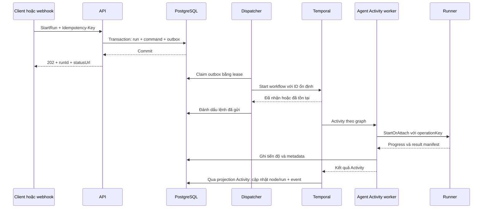

# Event-driven và thực thi bền vững

Trạng thái: thiết kế đề xuất, **05/09/2026**. Kiến trúc tổng thể: [architecture.md](architecture.md).

## 1. Có dùng event-driven được không?

**Có, và nên dùng kết hợp một bộ điều phối có trạng thái lưu bền.** Ví dụ webhook tạo run; agent phát tiến độ; người dùng duyệt phát lệnh tiếp tục; workflow hoàn thành phát sự kiện cho hệ thống khác.

Nếu từng service chỉ nghe sự kiện rồi tự quyết định bước tiếp theo, logic branch/join, timeout và hủy sẽ bị phân tán. Đề xuất của AgentFlow là orchestration cho đường thực thi, publish/subscribe cho quan sát và tích hợp.

Ba khái niệm khác nhau:

- **Command:** yêu cầu làm việc, có thể bị từ chối, ví dụ `StartRun`, `CancelRun`, `DecideApproval`.
- **Event:** thông báo một việc đã được ghi nhận, ví dụ `run.started`, `approval.decided`.
- **Progress:** thông tin tạm thời như text delta hoặc log; không dùng để xác nhận node thành công.

Event-driven không bắt buộc có Kafka. MVP dùng PostgreSQL outbox, dispatcher và Temporal task queues; UI nhận sự kiện qua SSE. Khi cần fan-out tới nhiều dịch vụ độc lập, thêm NATS JetStream. JetStream có persistence, replay và giao ít nhất một lần; Core NATS thuần có đặc tính khác. Nguồn: [NATS JetStream](https://docs.nats.io/concepts/jetstream).

Không áp dụng event sourcing cho toàn bộ dữ liệu sản phẩm trong MVP. Temporal history phục vụ recovery engine; run event log phục vụ audit/UI; workflow draft và membership vẫn dùng mô hình relational thông thường.

## 2. Đường đi của một run



API chỉ trả `202` sau khi transaction đã commit. Nếu Temporal tạm ngừng, run ở trạng thái queued và dispatcher thử lại. Nếu dispatcher chết sau khi Temporal đã nhận nhưng trước khi cập nhật outbox, lần gửi lại dùng cùng workflow ID và chính sách conflict/reuse từ chối tạo execution khác. Đồng thời khóa idempotency ở database phải còn hiệu lực sau khi Temporal history hết retention.

Transactional outbox giải quyết khoảng hở giữa commit database và gửi thông điệp. Việc gửi lại vẫn có thể tạo duplicate nên consumer phải idempotent. Nguồn: [AWS — Transactional outbox pattern](https://docs.aws.amazon.com/prescriptive-guidance/latest/cloud-design-patterns/transactional-outbox.html).

## 3. Graph interpreter trên Temporal

Một Workflow Execution logic của AgentFlow chạy graph interpreter với **snapshot workflow version bất biến**. Interpreter chịu trách nhiệm chọn node đủ điều kiện, giới hạn parallelism, branch/join, deadline và trạng thái kết thúc.

Trong Workflow code chỉ thực hiện logic deterministic và dùng API thời gian/signal của Temporal. Gọi model, filesystem, network, SDK agent, database và publish event đều qua Activities. Kết quả Activity đã ghi trong history được sử dụng khi replay; một Activity chưa ghi nhận kết quả có thể chạy lại. Nguồn: [Temporal TypeScript Workflow basics](https://docs.temporal.io/develop/typescript/workflows/basics).

Đề xuất ranh giới Activity:

- `loadWorkflowSnapshot`: nạp snapshot/version/hash và trả dữ liệu nhỏ vào history.
- `executeConnector`: gọi một operation bên ngoài với idempotency key.
- `superviseAgent`: khởi chạy hoặc gắn lại vào runner job, heartbeat và nhận kết quả.
- `persistProjection`: ghi trạng thái UI và domain event trong cùng transaction.
- `createApproval`: lưu yêu cầu duyệt; Workflow chờ decision bằng Signal và timer.

Không đưa từng token vào Temporal history. Lưu output lớn ở artifact storage; Activity trả object reference, checksum và kết quả nhỏ cần cho branch. Với loop/subflow lớn ở giai đoạn sau, giới hạn số bước và dùng child workflow/Continue-As-New phù hợp; cần chuyển cả state và danh sách command đã xử lý sang execution tiếp theo.

Khi deploy interpreter mới, dùng cơ chế versioning/patching tương thích history và chạy replay test. Khóa phiên bản DSL thôi chưa đủ: code interpreter, node implementation và runtime image cũng phải được xác định. Tham khảo nhóm tài liệu [Temporal TypeScript Workflows](https://docs.temporal.io/develop/typescript/workflows).

## 4. Hợp đồng event

Đây là envelope nội bộ đề xuất, không phải nguyên mẫu API Codex/OpenCode và không tuyên bố tuân thủ CloudEvents.

```json
{
  "eventId": "evt_01",
  "type": "agent.turn.completed",
  "schemaVersion": 1,
  "occurredAt": "2026-09-05T12:00:00Z",
  "tenantId": "tenant_01",
  "projectId": "project_01",
  "runId": "run_01",
  "nodeExecutionId": "exec_fix_01",
  "attempt": 1,
  "aggregateId": "exec_fix_01",
  "aggregateSequence": 12,
  "correlationId": "run_01",
  "causationId": "cmd_01",
  "traceparent": "00-4bf92f3577b34da6a3ce929d0e0e4736-00f067aa0ba902b7-01",
  "payload": {
    "provider": "codex",
    "sessionRef": "session_01",
    "resultRef": "artifact_result_01"
  }
}
```

`agent.turn.completed` chỉ mô tả trạng thái runtime. Node chỉ thành công sau khi AgentFlow kiểm tra output schema, lưu artifact và Workflow ghi nhận kết quả. Agent tự viết “done” trong text không phải tín hiệu kết thúc hợp lệ.

Quy tắc:

1. Event ID giữ nguyên khi phát lại cùng event; thay đổi ngữ nghĩa không tương thích thì tăng schema version.
2. Sequence tăng trong từng aggregate, cấp bằng transaction hoặc một writer; không giả định thứ tự toàn cục dựa trên timestamp.
3. UI dùng cursor server riêng cho stream theo run; không trộn cursor UI với sequence của nhiều node.
4. Payload dùng reference cho log/diff lớn; không chứa credential, prompt đầy đủ hoặc dữ liệu nhạy cảm mặc định.
5. Consumer khóa duy nhất `(consumerId, eventId)` trong inbox, commit tác động database cùng inbox rồi mới ACK.
6. Consumer gặp event cũ không được kéo trạng thái terminal về running. Gap sequence khiến consumer nạp snapshot hoặc chờ bù sự kiện.

## 5. Retry và idempotency

Thiết kế cho **at-least-once delivery**, không hứa exactly-once đối với thao tác ở hệ thống bên ngoài.

`operationKey = tenantId / logicalRunId / nodeInvocationId / operationName`

Key trên giữ nguyên qua retry kỹ thuật. `attempt` dùng cho log, lease và chi phí; không đưa attempt vào key chống lặp tác động. Khi chủ động chạy lại để tạo một kết quả mới, tạo invocation/run mới và lưu liên hệ với lần trước.

| Thao tác | Cách tránh làm lặp |
| --- | --- |
| Webhook trùng | Unique theo tenant + trigger + upstream delivery ID; payload hash phát hiện tái dùng key với nội dung khác |
| Scheduler gửi trùng | Key theo trigger + thời điểm lịch dự kiến; lưu timezone và chính sách missed run |
| Tạo runner job | Unique operation key; retry truy vấn/attach job cũ trước |
| Ghi artifact | Object key bất biến, checksum, finalize manifest idempotent |
| Gọi API có idempotency | Truyền cùng key và giữ bản ghi kết quả |
| Tạo PR/API không có idempotency đủ mạnh | Đối soát theo repo, branch, marker/operation key; timeout không rõ kết quả thì chuyển `RECONCILIATION_REQUIRED` |
| Nhận decision duyệt | Unique command ID và kiểm tra trạng thái request bằng compare-and-set |

Outbox/inbox không tự làm cho một cuộc gọi API và database commit trở thành atomic. Sau timeout, tác động bên ngoài có thể đã xảy ra. Với tác động không thể đối soát, dừng để kiểm tra thay vì tự gửi lại.

| Nhóm lỗi | Chính sách đề xuất |
| --- | --- |
| Rate limit, lỗi mạng tạm thời | Retry có giới hạn, exponential backoff + jitter; tôn trọng Retry-After |
| Auth, cấu hình/schema sai, policy deny | Không retry tự động; trả lỗi có thể sửa |
| Agent output không đúng schema | Tối đa một lượt sửa có budget; sau đó fail node |
| Test thất bại | Output nghiệp vụ `passed: false`, đi nhánh được thiết kế; không retry vô hạn |
| Worker chết, mất heartbeat | Reconcile job cũ trước khi tiếp tục hoặc chạy lại |
| Hết budget/deadline | Hủy và cleanup; không coi là lỗi mạng để retry |

Temporal Activity có timeout/retry và nhận cancellation qua heartbeat. Tuy nhiên worker hoặc subprocess vẫn cần chủ động xử lý hủy; timeout phía engine không tự giết process. Nguồn: [Temporal Activity Execution](https://docs.temporal.io/activity-execution).

## 6. Worker chết và tác vụ vẫn đang chạy

Đề xuất runner supervisor có job registry, heartbeat, lease và fencing generation:

1. Activity lấy lease cho operation key, nhận generation hiện tại.
2. Runner nhận `StartOrAttach`; không tạo hai job cho cùng operation key.
3. Activity heartbeat tiến độ và lease; runner giữ result manifest đủ lâu để worker khác lấy lại.
4. Khi worker chết, worker mới hỏi trạng thái runner. Job đang chạy thì attach; đã xong thì lấy manifest.
5. Nếu runner mất, phục hồi workspace từ snapshot và xác minh trạng thái session. Chỉ chạy attempt mới khi biết job cũ đã dừng hoặc đã bị fence khỏi mọi đường ghi quan trọng.
6. Nếu chưa xác định được trạng thái tác động bên ngoài, đánh dấu cần đối soát. Khóa database đơn thuần không ngăn được subprocess cũ tiếp tục gọi API.

Fencing chỉ có hiệu lực với tài nguyên kiểm tra token đó. Vì vậy các thao tác xuất bản nên đi qua connector/tool gateway kiểm tra generation và operation key; không trao credential xuất bản trực tiếp cho coding agent.

## 7. Human approval

Bước Approval của workflow lưu request rồi chờ **Signal + durable timer**. UI đóng hoặc API restart không làm mất trạng thái chờ. Signal dùng để cập nhật Workflow, Query dùng để đọc; truy cập từ người dùng vẫn đi qua API phân quyền. Nguồn: [Temporal message passing](https://docs.temporal.io/develop/typescript/workflows/message-passing).

API kiểm tra reviewer scope, request expiry, action hash và trạng thái trước khi ghi command/outbox. Chỉ một decision thắng compare-and-set. Workflow kiểm tra lại request ID/hash/deadline và đánh dấu decision applied; nếu hết hạn trong khoảng dispatch, quyết định bị từ chối. API trả “đã nhận” khác với “đã áp dụng”.

Approval gắn với đúng diff/commit/operation và phiên bản policy. Artifact thay đổi thì duyệt lại. Deny hoặc timeout đi nhánh đã định nghĩa; không tự biến timeout thành đồng ý.

Phân biệt bước duyệt workflow với permission request xuất hiện giữa turn của agent. Loại thứ hai còn phụ thuộc tiến trình và giao thức runtime, xem [agent-integration.md](agent-integration.md).

## 8. Trạng thái, hủy và bù trừ

Đề xuất node state:

```text
PENDING -> READY -> RUNNING -> SUCCEEDED
                     |-----> RETRY_WAIT -> READY
                     |-----> WAITING_APPROVAL -> RUNNING
                     |-----> RECONCILIATION_REQUIRED -> RUNNING hoặc FAILED
                     |-----> FAILED / TIMED_OUT
PENDING / READY / RUNNING / WAITING_APPROVAL -> CANCEL_REQUESTED -> CANCELLED
PENDING -> SKIPPED (nhánh không được chọn)
```

`WAITING_APPROVAL -> RUNNING` chỉ khi đúng decision được áp dụng; deny/expiry dẫn đến output hoặc lỗi theo cấu hình. Run có trạng thái tổng hợp riêng: `QUEUED`, `RUNNING`, `WAITING_APPROVAL`, `NEEDS_ATTENTION`, `CANCEL_REQUESTED`, `CANCELLED`, `SUCCEEDED`, `FAILED`, `TIMED_OUT`. Run chỉ `WAITING_APPROVAL` khi không còn node hoạt động và có bước đang chờ; một nhánh chờ không che mất nhánh khác đang chạy.

Khi cancel: ngừng schedule node mới, gửi cancel tới Activity, adapter abort/interrupt, hết grace period thì supervisor dừng cây process/container. Chỉ báo `CANCELLED` khi xử lý dừng hoàn tất; job chưa xác minh được hiển thị cần kiểm tra. Run đã terminal không đổi trạng thái do event muộn.

Hủy không hoàn tác API đã gọi. Với nhiều bước có tác động, khai báo compensation có idempotency riêng, thực hiện ngược thứ tự bước thành công. Tác động không đảo ngược phải được thể hiện trong kết quả; không tuyên bố rollback như một transaction database.

## 9. Streaming, backpressure và mở rộng broker

SSE đọc event log theo cursor, hỗ trợ kết nối lại bằng Last-Event-ID trong thời gian retention. Nếu cursor hết hạn, UI nhận hướng dẫn tải snapshot mới. Text delta có thể batch và retention ngắn; lifecycle/approval/result phải lưu bền. Chậm hiển thị tiến độ không được đổi kết quả workflow.

Giới hạn concurrency theo tenant/provider/runner pool; queue job trước khi cấp sandbox; giới hạn log bytes và artifact size. Cần budget chung cho cả retry và các nhánh song song. Khi thêm JetStream, outbox chờ publish ACK, consumer ACK sau commit; lưu lỗi quá số lần retry vào parking table/queue có công cụ redrive. Không giả định broker tự có dead-letter workflow đúng nhu cầu sản phẩm.

Projection có thể trễ khi database lỗi. Workflow retry Activity ghi projection; watchdog so sánh run đang mở với trạng thái Temporal để sửa bản ghi mắc kẹt, kể cả trường hợp execution bị terminate ngoài ứng dụng. Reconciler chỉ sửa read model, không tự chạy lại node hay side effect.
