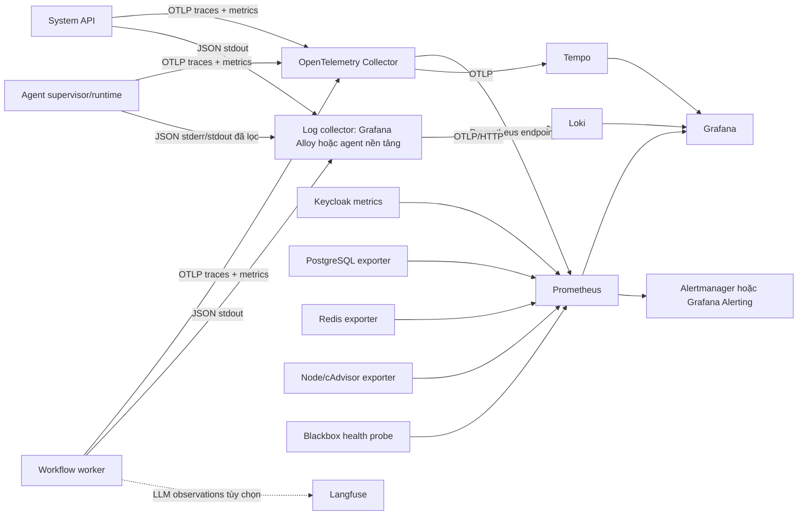

# Tích hợp giám sát và observability cho AgentFlow

Ngày cập nhật: **04/10/2026**. Trạng thái: **thiết kế và hướng dẫn triển khai; monitoring stack chưa được thêm vào Compose hiện tại**.

Tài liệu này mô tả cách bổ sung metrics, logs, traces, dashboard và cảnh báo cho AgentFlow. Mục tiêu là trả lời được bốn câu hỏi vận hành:

1. API, worker, queue và các dependency có đang phục vụ được không?
2. Một workflow run đang chậm hoặc lỗi tại bước nào?
3. Lỗi đến từ AgentFlow, container runtime, database, queue hay LLM provider?
4. Hệ thống có sắp vượt giới hạn tài nguyên, backlog, token hoặc chi phí không?

`runs` và `run_steps` vẫn là nguồn dữ liệu nghiệp vụ có thẩm quyền. Monitoring phục vụ phát hiện và chẩn đoán; không dùng Prometheus, Loki, Tempo hoặc Langfuse để quyết định trạng thái workflow.

## 1. Hiện trạng và khoảng trống

| Thành phần | Đã có | Cần bổ sung |
| --- | --- | --- |
| System API | `GET /health` kiểm tra liveness; `GET /ready` kiểm tra PostgreSQL | OTLP application metrics, request trace, dependency spans, readiness của dependency bắt buộc |
| Workflow worker | Log bằng Python `logging`; Redis consumer group có reclaim | Structured log, trace qua từng node, queue/outbox metrics, worker heartbeat |
| Agent container | Exit code, timeout và giới hạn output do supervisor xử lý | Duration, OOM/exit reason, container start, cleanup và artifact metrics |
| Keycloak | Đã bật health và metrics trên management port `9000` | Prometheus scrape và dashboard/alert |
| PostgreSQL, Redis | Có healthcheck trong Compose | Exporter và cảnh báo capacity/latency |
| Web | Nginx healthcheck | Frontend error/performance telemetry ở giai đoạn sau |
| LLM | `run_steps` lưu trạng thái/output | Token, cost, latency, retry/rate-limit; Langfuse là tùy chọn |

Không coi Docker healthcheck là monitoring. Healthcheck chỉ giúp runtime quyết định container có sống/sẵn sàng; metric và alert mới cho biết xu hướng, mức tải và nguyên nhân suy giảm.

## 2. Kiến trúc đề xuất



OpenTelemetry Collector là ranh giới thu nhận để ứng dụng không phụ thuộc trực tiếp vào một backend. Collector nhận OTLP, batch/lọc telemetry rồi xuất metrics cho Prometheus và traces cho Tempo. OpenTelemetry cung cấp instrumentation và đường truyền telemetry, không phải nơi lưu trữ hay dashboard; xem [OpenTelemetry Collector](https://opentelemetry.io/docs/collector/) và [cấu hình OTLP exporter](https://opentelemetry.io/docs/specs/otel/protocol/exporter/).

### Bộ công cụ mặc định

| Nhu cầu | Công cụ | Ghi chú |
| --- | --- | --- |
| Instrumentation và truyền telemetry | OpenTelemetry SDK + Collector | Chuẩn chung cho API, worker và runner |
| Metrics | Prometheus | Scrape Collector và exporter hạ tầng |
| Logs | JSON stdout + Grafana Alloy + Loki | Không ghi trực tiếp vào Loki từ business code |
| Traces | Tempo | Tìm theo `trace_id`, liên kết từ log/dashboard |
| Dashboard và alert | Grafana; Alertmanager khi cần routing độc lập | Provision cấu hình từ Git, không cấu hình tay ở production |
| Hạ tầng | Keycloak metrics, postgres/Redis exporter, cAdvisor/node exporter | Node Exporter dùng cho Linux; Windows host dùng Windows Exporter |
| Synthetic health | Prometheus Blackbox Exporter hoặc probe của nền tảng | Kiểm tra `/health` và `/ready` từ bên ngoài process |
| Quan sát LLM tùy chọn | Langfuse | Chỉ cho generation/token/cost/latency đã qua policy dữ liệu |

Có thể thay Prometheus/Loki/Tempo bằng dịch vụ managed hỗ trợ OTLP mà không đổi semantic instrumentation trong ứng dụng. Grafana hỗ trợ provision data source và dashboard bằng file để version-control; xem [Grafana provisioning](https://grafana.com/docs/grafana/latest/administration/provisioning/).

## 3. Mô hình tương quan dữ liệu

Mọi service dùng W3C Trace Context. `traceparent` phải được truyền qua HTTP và payload công việc nội bộ; với Redis Stream, lưu `traceparent`/`tracestate` trong message fields hoặc metadata thay vì tự chế định dạng trace ID.

Các định danh sau được đặt trong **span attribute và structured log**, không đặt làm metric label:

- `run_id`, `workflow_id`, `workflow_version_id`;
- `node_id`, `node_execution_id`, `attempt_id`;
- `job_id`, `runner_id`, `container_id`;
- `tenant_key`/`project_key` đã giả danh nếu cần điều tra theo phạm vi truy cập.

Không ghi `owner_subject`, email hoặc định danh người dùng thô vào telemetry. Ánh xạ tenant/project phải ổn định trong phạm vi cần điều tra, không cho phép suy ngược danh tính và phải tuân theo quyền truy cập của backend quan sát.

Resource attributes ổn định trên mọi signal:

```text
service.name=agentflow-system | agentflow-workflow-worker | agentflow-runner
service.version=<git-sha-or-release>
deployment.environment=local | staging | production
service.instance.id=<instance-id>
```

Metric labels chỉ dùng tập giá trị nhỏ và hữu hạn, ví dụ `service`, `route`, `method`, `status_code`, `node_type`, `runtime`, `provider`, `status`, `error_code`. Không dùng URL đầy đủ, exception message, prompt, model response, user ID hoặc UUID. Prometheus khuyến nghị kiểm soát cardinality và chuyển chiều dữ liệu tăng không giới hạn sang log/trace thay vì label; xem [Prometheus instrumentation practices](https://prometheus.io/docs/practices/instrumentation/).

## 4. Telemetry cần phát

Tên metric dưới đây là contract đề xuất. Dùng base unit trong tên (`seconds`, `bytes`) và counter kết thúc bằng `_total`.

### API và dependency

| Metric | Kiểu | Labels hữu hạn | Ý nghĩa |
| --- | --- | --- | --- |
| `agentflow_http_server_requests_total` | Counter | `method`, `route`, `status_code` | Lưu lượng và tỷ lệ lỗi API |
| `agentflow_http_server_duration_seconds` | Histogram | `method`, `route`, `status_code` | Latency API; `route` là route template |
| `agentflow_dependency_requests_total` | Counter | `dependency`, `operation`, `status` | PostgreSQL, Redis, provider, MCP |
| `agentflow_dependency_duration_seconds` | Histogram | `dependency`, `operation`, `status` | Latency dependency |
| `agentflow_db_pool_connections` | UpDownCounter/Gauge | `state` | Pool used/idle/overflow |

### Workflow, queue và outbox

| Metric | Kiểu | Labels hữu hạn | Ý nghĩa |
| --- | --- | --- | --- |
| `agentflow_runs_started_total` | Counter | `trigger_type` | Run được nhận bền vững |
| `agentflow_runs_completed_total` | Counter | `status` | Kết quả terminal của run |
| `agentflow_run_duration_seconds` | Histogram | `status` | Thời gian máy thực thi; tách thời gian chờ duyệt |
| `agentflow_node_attempts_total` | Counter | `node_type`, `status`, `error_code` | Attempt, retry và lỗi chuẩn hóa |
| `agentflow_node_duration_seconds` | Histogram | `node_type`, `status` | Thời gian node |
| `agentflow_queue_messages` | Gauge | `state` | Ready/pending/reclaimable messages |
| `agentflow_queue_oldest_age_seconds` | Gauge | Không | Tuổi message cũ nhất chưa xử lý |
| `agentflow_outbox_pending` | Gauge | Không | Số dispatch chưa publish |
| `agentflow_outbox_oldest_age_seconds` | Gauge | Không | Tuổi outbox cũ nhất chưa dispatch |
| `agentflow_worker_heartbeat_timestamp_seconds` | Gauge | `worker_pool` | Phát hiện worker pool mất heartbeat |

Nếu cần biết backlog theo tenant lớn, dùng top-N report từ PostgreSQL hoặc log phân tích; không thêm `tenant_id` vào label Prometheus.

### Runner, agent và LLM

| Metric | Kiểu | Labels hữu hạn | Ý nghĩa |
| --- | --- | --- | --- |
| `agentflow_agent_jobs` | Gauge | `state`, `runtime` | Queued/running/cleanup pending |
| `agentflow_agent_job_duration_seconds` | Histogram | `runtime`, `status`, `error_code` | Thời gian attempt agent |
| `agentflow_agent_container_start_seconds` | Histogram | `runtime`, `status` | Thời gian tạo/start container |
| `agentflow_agent_container_exits_total` | Counter | `runtime`, `reason` | Exit, timeout, OOM, cancelled |
| `agentflow_agent_cleanup_total` | Counter | `status` | Cleanup và orphan reconciliation |
| `agentflow_llm_requests_total` | Counter | `provider`, `model_family`, `status` | Request, lỗi và rate-limit |
| `agentflow_llm_duration_seconds` | Histogram | `provider`, `model_family`, `status` | Provider latency |
| `agentflow_llm_tokens_total` | Counter | `provider`, `model_family`, `token_type` | Input/output/cache tokens nếu provider trả usage |
| `agentflow_llm_cost_estimate_total` | Counter | `provider`, `currency` | Ước tính theo pricing version đã lưu |

Không đưa tên model tự do vào label. Ánh xạ model đã cho phép sang `model_family` hữu hạn hoặc để model đầy đủ trong span/log.

### Span tối thiểu

- HTTP server span cho mỗi API request; bỏ `/health`, `/ready` khỏi sampling chi tiết nếu gây nhiễu.
- `workflow.dispatch`, `workflow.run`, `workflow.node` và `workflow.node.attempt`.
- `redis.xadd`, `redis.xreadgroup`, `redis.xack`, `redis.xautoclaim`.
- PostgreSQL query spans đã sanitize; không thu statement chứa secret/payload.
- `agent.container.create`, `agent.container.wait`, `agent.result.validate`, `agent.cleanup`.
- `llm.chat` và `mcp.tool.call`, chỉ ghi metadata an toàn như provider, model family, tool name, token count và status.

## 5. Structured log và bảo vệ dữ liệu

Ứng dụng ghi một JSON object trên mỗi dòng ra stdout/stderr. Schema nền:

```json
{
  "timestamp": "2026-10-04T08:30:00.000Z",
  "level": "INFO",
  "service": "agentflow-workflow-worker",
  "environment": "local",
  "event": "workflow.run.completed",
  "message": "Workflow run completed",
  "trace_id": "4bf92f3577b34da6a3ce929d0e0e4736",
  "span_id": "00f067aa0ba902b7",
  "run_id": "...",
  "node_execution_id": "...",
  "status": "succeeded",
  "duration_ms": 1240
}
```

Quy tắc bắt buộc:

- dùng `event` ổn định để truy vấn; `message` chỉ phục vụ người đọc;
- exception gồm `error.type`, `error.code` chuẩn hóa và stack trace; không dùng nguyên exception message làm label;
- mặc định không log access token, API key, cookie, Authorization header, provider request/response thô, prompt, tool arguments/output hoặc nội dung artifact;
- redaction theo allowlist tại source trước khi telemetry rời process; Collector là lớp phòng vệ thứ hai, không phải lớp duy nhất;
- giới hạn kích thước log từ agent và đánh dấu `truncated=true` khi cắt;
- Loki labels chỉ gồm `service_name`, `environment`, `level`; giữ run/node/trace ID trong structured metadata để tránh cardinality cao. Loki hỗ trợ nhận log OTLP qua endpoint native; xem [Loki OTLP ingestion](https://grafana.com/docs/loki/latest/send-data/otel/).

Retention khởi đầu cho môi trường nội bộ có thể là metrics 30 ngày, logs 14 ngày và traces 7 ngày. Đây là giá trị vận hành cần được chốt theo dung lượng, yêu cầu audit và chính sách dữ liệu; lifecycle của business event/artifact là policy riêng.

## 6. Cách triển khai trong repository

Triển khai theo lát cắt; mỗi giai đoạn phải dùng được độc lập và có tiêu chí nghiệm thu.

### Giai đoạn 1 — Dựng monitoring stack local

Thêm cấu trúc dự kiến:

```text
compose.observability.yaml
infra/observability/
  otel-collector.yaml
  prometheus.yaml
  rules/agentflow.yaml
  tempo.yaml
  loki.yaml
  alloy.alloy
  grafana/
    provisioning/datasources/agentflow.yaml
    provisioning/dashboards/agentflow.yaml
    dashboards/system-overview.json
    dashboards/workflow-runtime.json
```

Giữ stack trong file Compose override để `compose.yaml` cốt lõi vẫn nhẹ. Các service nên cùng network `backend`; chỉ Grafana (`127.0.0.1:3001`) và Prometheus UI khi cần debug (`127.0.0.1:9090`) được bind ra localhost. Không public cổng OTLP, Loki, Tempo, exporter hoặc management port trong production.

Collector tối thiểu cho traces và application metrics:

```yaml
receivers:
  otlp:
    protocols:
      grpc:
        endpoint: 0.0.0.0:4317
      http:
        endpoint: 0.0.0.0:4318

processors:
  memory_limiter:
    check_interval: 1s
    limit_mib: 256
  batch: {}

exporters:
  prometheus:
    endpoint: 0.0.0.0:8889
  otlp/tempo:
    endpoint: tempo:4317
    tls:
      insecure: true

service:
  pipelines:
    metrics:
      receivers: [otlp]
      processors: [memory_limiter, batch]
      exporters: [prometheus]
    traces:
      receivers: [otlp]
      processors: [memory_limiter, batch]
      exporters: [otlp/tempo]
```

Prometheus scrape tối thiểu:

```yaml
global:
  scrape_interval: 15s
  evaluation_interval: 15s

rule_files:
  - /etc/prometheus/rules/*.yaml

scrape_configs:
  - job_name: otel-collector
    static_configs:
      - targets: [otel-collector:8889]
  - job_name: keycloak
    metrics_path: /metrics
    static_configs:
      - targets: [keycloak:9000]
```

Keycloak hiện đã bật `KC_METRICS_ENABLED=true`; endpoint `/metrics` dùng OpenMetrics trên management interface. Xem [Keycloak metrics](https://www.keycloak.org/observability/configuration-metrics). Thêm PostgreSQL/Redis exporter sau khi đặt credential bằng Compose secret hoặc secret manager, không nhúng password vào file scrape config.

Lệnh dự kiến sau khi các file trên được triển khai:

```powershell
docker compose -f compose.yaml -f compose.observability.yaml config
docker compose -f compose.yaml -f compose.observability.yaml up -d --build
docker compose -f compose.yaml -f compose.observability.yaml ps
```

Tiêu chí nghiệm thu: Grafana tự có ba data source Prometheus/Loki/Tempo; Prometheus target Collector và Keycloak đều `UP`; restart stack không làm mất provisioning.

### Giai đoạn 2 — Instrument System API và workflow worker

1. Thêm và khóa phiên bản các package Python: OpenTelemetry SDK, OTLP exporter và instrumentation cho FastAPI, ASGI, HTTPX, SQLAlchemy, Redis và logging. Python OpenTelemetry hỗ trợ instrumentation library cho framework/dependency; xem [OpenTelemetry Python libraries](https://opentelemetry.io/docs/languages/python/libraries/).
2. Tạo `src/system/core/telemetry.py` với một hàm khởi tạo idempotent. Hàm cấu hình resource, tracer provider, meter provider, OTLP exporter, sampling và shutdown flush.
3. Gọi khởi tạo trước khi tạo FastAPI app và trước vòng lặp trong `runtime.worker`. Không khởi tạo lại provider sau fork/process start.
4. Instrument FastAPI/HTTPX/SQLAlchemy/Redis tự động; tạo manual spans và domain metrics tại ranh giới dispatch, run, node, agent container và provider.
5. Chuyển cấu hình `logging.basicConfig` rải rác sang một module logging chung, inject `trace_id`/`span_id` và xuất JSON.
6. Đăng ký shutdown hook để flush telemetry có giới hạn thời gian; lỗi exporter không được làm hỏng workflow.

Biến môi trường chung:

```dotenv
OTEL_SDK_DISABLED=false
OTEL_EXPORTER_OTLP_ENDPOINT=http://otel-collector:4317
OTEL_EXPORTER_OTLP_PROTOCOL=grpc
OTEL_RESOURCE_ATTRIBUTES=deployment.environment=local
OTEL_TRACES_SAMPLER=parentbased_traceidratio
OTEL_TRACES_SAMPLER_ARG=1.0
OTEL_METRIC_EXPORT_INTERVAL=15000
LOG_FORMAT=json
LOG_LEVEL=INFO
```

Đặt `OTEL_SERVICE_NAME` riêng cho `system` và `workflow-worker`; không nhét service name vào `OTEL_RESOURCE_ATTRIBUTES` dùng chung. Local có thể sample 100%; production bắt đầu thấp hơn và luôn giữ error/slow trace bằng tail sampling tại Collector nếu có đủ capacity. Không bật capture HTTP body, SQL parameters hoặc headers nhạy cảm.

Tiêu chí nghiệm thu: gọi API tạo run sinh một distributed trace nối API → outbox/Redis → worker → node; log của cùng run tìm được bằng `trace_id`; Prometheus có request/run/node metrics nhưng không có UUID trong labels.

### Giai đoạn 3 — Thu log và metric hạ tầng

1. Cấu hình Alloy đọc Docker container stdout/stderr, parse JSON, thêm `service_name` và gửi OTLP/HTTP tới Loki. Trong Kubernetes, thay bằng DaemonSet/agent của nền tảng.
2. Scrape PostgreSQL exporter và Redis exporter bằng account chỉ đọc/ít quyền nhất.
3. Dùng Blackbox Exporter hoặc synthetic probe của nền tảng gọi `/health` và `/ready` từ ngoài process; health `200` bên trong container không chứng minh đường mạng từ load balancer còn hoạt động.
4. Trên Linux runner, dùng node exporter cho host và cAdvisor hoặc runtime metrics cho container. Docker Desktop trên Windows chạy container trong Linux VM nên metric host Windows cần Windows Exporter riêng nếu thực sự cần quan sát máy chủ.
5. Scrape self-metrics của Collector, Prometheus, Loki và Tempo để phát hiện pipeline telemetry bị drop/backpressure.

Tiêu chí nghiệm thu: có thể đi từ một panel lỗi → exemplar/trace → log theo `trace_id`; có dashboard CPU/RAM/disk, DB connections, Redis memory/pending entries và container OOM.

### Giai đoạn 4 — Dashboard, SLO và cảnh báo

Provision ít nhất ba dashboard:

- **System overview:** request rate/error/latency, dependency health, DB pool, Redis, worker heartbeat.
- **Workflow runtime:** started/completed/failed, duration, queue age, outbox lag, node retry/error theo type.
- **Agent runtime & LLM:** queued/running, container start/OOM/timeout/cleanup, provider latency/429, token và cost estimate.

Mục tiêu PoC ban đầu, chưa phải SLA production:

| SLI | Mục tiêu |
| --- | --- |
| API durable start availability | 99,5% trong cửa sổ 30 ngày, loại maintenance đã công bố |
| Start API latency | p95 dưới 500 ms cho payload nhỏ |
| Queue wait | p95 dưới 5 giây ở tải nghiệm thu |
| Tiến độ tới UI | p95 dưới 2 giây, không gồm thời gian provider |
| Phát hiện worker mất heartbeat | dưới 60 giây |
| Cleanup container terminal | p99 dưới 60 giây |

Alert khởi đầu:

| Alert | Điều kiện gợi ý | Mức |
| --- | --- | --- |
| `AgentFlowSystemDown` | `probe_success{job="agentflow-system-health"} == 0` trong 2 phút | page |
| `AgentFlowApiHighErrorRate` | 5xx > 5% và đủ lưu lượng trong 10 phút | page |
| `AgentFlowQueueStalled` | queue oldest age > 5 phút và tăng | page |
| `AgentFlowOutboxStalled` | outbox oldest age > 1 phút trong 5 phút | ticket/page theo tải |
| `AgentFlowWorkerMissing` | heartbeat age > 60 giây khi có backlog | page |
| `AgentFlowAgentFailureSpike` | timeout/OOM/runtime error tăng bất thường | ticket |
| `AgentFlowProviderRateLimited` | tỷ lệ 429 vượt ngưỡng theo provider | ticket |
| `TelemetryPipelineDropping` | Collector/Loki/Prometheus báo dropped/refused data | ticket |

Dùng `for` để tránh alert chập chờn và ghi annotation có dashboard/runbook URL. Prometheus alerting rules hỗ trợ điều kiện giữ trong một khoảng trước khi firing; xem [Prometheus alerting rules](https://prometheus.io/docs/prometheus/latest/configuration/alerting_rules/). Không gửi `run_id` vào notification tổng quát; người trực truy từ trace/log theo thời gian và service.

### Giai đoạn 5 — Langfuse tùy chọn

Chỉ thêm Langfuse khi cần phân tích chất lượng/cost của LLM sâu hơn dashboard vận hành:

- một AgentFlow run ánh xạ thành Langfuse trace;
- node/attempt ánh xạ thành span;
- mỗi LLM request ánh xạ thành generation;
- gửi provider, model, latency, usage, cost estimate, error code và các tag hữu hạn;
- prompt/completion/tool content mặc định tắt; chỉ bật theo project khi có consent, redaction và retention phù hợp;
- lỗi Langfuse không được làm fail node hoặc thay trạng thái `run_steps`.

Langfuse self-host bổ sung đáng kể thành phần lưu trữ/vận hành, vì vậy không ghép vào Compose mặc định. Có thể dùng deployment riêng hoặc managed service sau đánh giá dữ liệu. Xem [Langfuse observability data model](https://langfuse.com/docs/observability/data-model).

## 7. Readiness, liveness và dependency policy

- `/health`: chỉ xác nhận process/event loop còn sống; không gọi dependency.
- `/ready`: xác nhận instance có thể nhận công việc mới. API cần PostgreSQL; nếu việc nhận run bắt buộc queue trực tiếp thì kiểm tra Redis, còn mô hình outbox có thể vẫn ready khi Redis lỗi trong giới hạn backlog đã định.
- Worker không cần HTTP server chỉ để healthcheck. Ghi heartbeat bền vững hoặc metric timestamp và để orchestrator/runtime giám sát process.
- Không đưa LLM provider vào readiness chung: provider lỗi phải làm degraded/retry theo provider, không rút toàn bộ API khỏi load balancer.
- Endpoint metrics/health không chứa secret, nhưng vẫn chỉ mở trong management network. Keycloak cũng tách health trên management port theo [hướng dẫn health check](https://www.keycloak.org/observability/health).

## 8. Kiểm thử và failure drill

Checklist cho mỗi lần thay instrumentation hoặc monitoring config:

1. Validate Compose và Collector/Prometheus configuration trước khi restart.
2. Tạo một workflow gồm HTTP/transform/agent giả lập thành công; xác nhận đủ trace, metric và JSON log.
3. Cho node lỗi có chủ đích; xác nhận error code nhất quán và alert/dashboard tăng đúng.
4. Dừng `workflow-worker`; xác nhận queue age tăng và alert heartbeat/backlog firing rồi tự resolve sau phục hồi.
5. Dừng Redis; xác nhận outbox giữ command, API hành xử theo policy và không mất run.
6. Dừng Collector/Loki/Tempo; workflow vẫn chạy, exporter retry có giới hạn và không làm đầy memory/disk.
7. Tạo log chứa token giả; kiểm tra token không xuất hiện trong Loki, trace, dashboard hoặc alert.
8. Kiểm tra danh sách series để chắc chắn không có `run_id`, UUID, URL động hoặc error message làm label.

Definition of Done cho tích hợp đầu tiên:

- dashboard và data source được provision từ repository;
- một run tra cứu được xuyên API, queue, worker và node bằng trace/log;
- metric cover golden signals: traffic, errors, latency, saturation;
- alert quan trọng có owner, severity, runbook và đã test firing/resolution;
- telemetry outage không ảnh hưởng correctness của workflow;
- secret/payload nhạy cảm vượt qua kiểm thử redaction;
- retention, quyền truy cập và backup được ghi cho từng backend.

## 9. Production hardening

- Khóa phiên bản image và package; chạy migration/upgrade thử trên staging.
- Dùng TLS và authentication cho OTLP/remote write khi telemetry đi qua network boundary.
- Tách credential đọc exporter, Grafana admin và alert integration; lưu trong secret manager.
- Thiết lập memory limiter, batch, queue/retry và disk buffer phù hợp cho Collector/Alloy; theo dõi chính pipeline observability.
- Dùng object storage cho Loki/Tempo khi retention và HA yêu cầu; local filesystem chỉ phù hợp development/PoC.
- Đặt quota ingest, giới hạn label/attribute/log size và budget sampling để một workflow lỗi không làm sập monitoring.
- Phân quyền Grafana theo team/project; UUID khó đoán không phải cơ chế bảo mật. Telemetry đa tenant phải có isolation trước khi cho người dùng cuối truy cập.
- Giữ một đường giám sát ngoài cụm cho health của monitoring stack trong production; nếu toàn bộ stack cùng hỏng, alert nội bộ sẽ không gửi được.

## 10. Thứ tự thay đổi đề xuất

| Thứ tự | Phạm vi PR | Kết quả có thể kiểm chứng |
| --- | --- | --- |
| 1 | Compose override, Collector, Prometheus, Tempo, Loki, Grafana provisioning | Stack local lên và Keycloak target `UP` |
| 2 | Telemetry bootstrap + JSON logging cho System API | HTTP traces/metrics/log correlation |
| 3 | Worker propagation + workflow/node domain metrics | Một run nối được qua queue và worker |
| 4 | Alloy và infrastructure exporters | Logs/host/DB/Redis dashboard |
| 5 | Dashboard, alert rules và failure drills | Alert firing/resolution có runbook |
| 6 | Agent container + LLM usage/cost; Langfuse nếu cần | Runtime/provider visibility và budget tracking |

Không triển khai tất cả trong một PR. Lát cắt đầu tiên nên chứng minh một request tạo run có metric, trace và log tương quan; sau đó mới tăng số exporter, dashboard và retention.
