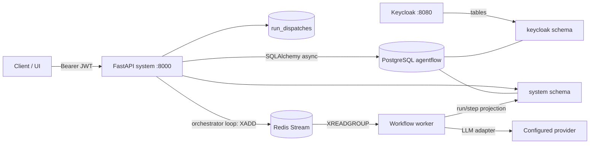
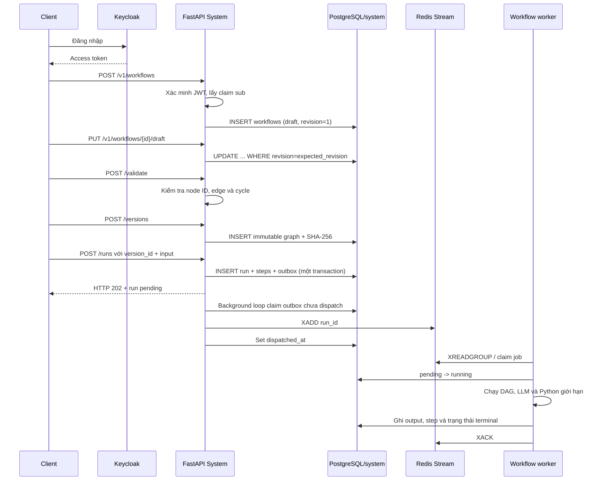
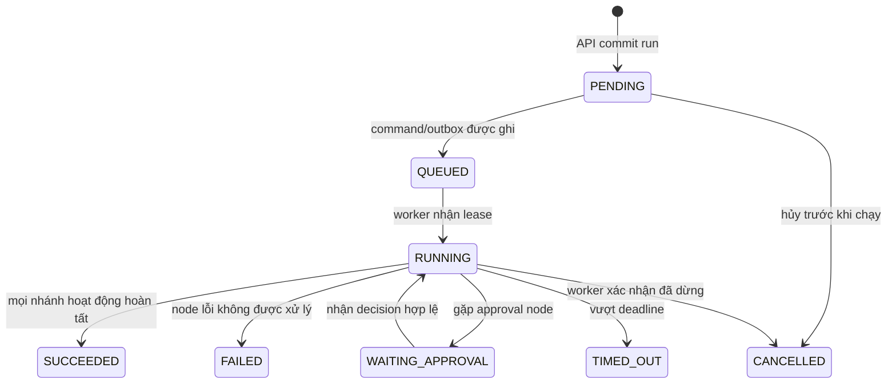

# Lưu trữ và xử lý một workflow

Tài liệu này mô tả đường đi của dữ liệu từ lúc người dùng tạo draft đến lúc một workflow run kết thúc. Phần **hiện có** phản ánh code trong `src/system`; phần **runtime mục tiêu** mô tả những khả năng bền vững còn cần bổ sung.

## 1. Ranh giới service và nơi lưu dữ liệu

Môi trường phát triển dùng một PostgreSQL database `agentflow`, nhưng mỗi service sở hữu schema riêng:

| Thành phần | Nơi lưu | Trách nhiệm |
| --- | --- | --- |
| FastAPI `system` / orchestrator | schema `system` + Redis Stream | API workflow, transactional outbox và dispatch `run_id` vào queue |
| Workflow worker | Không sở hữu database riêng | Claim job, chạy graph và cập nhật run/step projection |
| Redis | volume `agentflow_redis` | Queue at-least-once, consumer group và pending-entry list |
| Keycloak | schema `keycloak` | Realm, user, client, role, session đăng nhập |
| Agent integration | Không có database riêng | Nhận yêu cầu thực thi agent và trả kết quả có schema |
| Artifact storage, worker attempts | Chưa triển khai | Log lớn, file, diff, checkpoint, retry và lease bền vững |

Hai schema dùng chung PostgreSQL server/database để vận hành development đơn giản. Không tạo foreign key giữa `system` và `keycloak`; System chỉ tin danh tính `sub` sau khi xác minh JWT. Việc dùng chung database không cho phép System đọc hoặc sửa bảng nội bộ của Keycloak.

`db-init` trong `compose.yaml` tạo idempotent schema `system` và `keycloak`. Sau đó Keycloak quản lý bảng của schema `keycloak`, còn Alembic của System quản lý bảng và `alembic_version` trong schema `system`.



## 2. Các bảng hiện có

### `system.workflows`

Đây là bản chỉnh sửa hiện tại của workflow.

| Cột | Ý nghĩa |
| --- | --- |
| `id` | UUID ổn định của workflow |
| `owner_subject` | Claim `sub` lấy từ access token Keycloak; dùng để giới hạn truy vấn theo người dùng |
| `name` | Tên workflow |
| `draft` | JSONB chứa node, edge và cấu hình đang chỉnh sửa |
| `revision` | Số revision dùng cho optimistic locking |
| `created_at`, `updated_at` | Thời điểm tạo và cập nhật projection |

Khi lưu draft, client gửi `expected_revision`. Câu lệnh `UPDATE` chỉ thành công nếu revision trong database vẫn bằng giá trị client đã đọc. Hai editor cùng sửa một revision sẽ không âm thầm ghi đè nhau; request đến sau nhận HTTP `409` và phải tải draft mới.

### `system.workflow_versions`

Mỗi hàng là một snapshot đã publish và không được sửa tại chỗ.

| Cột | Ý nghĩa |
| --- | --- |
| `workflow_id`, `version` | Khóa duy nhất của số phiên bản trong một workflow |
| `graph` | Snapshot JSONB dùng cho thực thi |
| `content_hash` | SHA-256 của JSON canonical để nhận diện chính xác nội dung |
| `created_at` | Thời điểm publish |

Run luôn tham chiếu `workflow_version_id`, không tham chiếu draft. Vì vậy việc sửa canvas sau khi start không thay đổi graph của run đang chạy.

### `system.runs`

Đây là projection trạng thái cấp run dành cho API/UI.

| Cột | Ý nghĩa |
| --- | --- |
| `workflow_version_id` | Snapshot workflow được chọn để chạy |
| `owner_subject` | Chủ thể Keycloak tạo run |
| `status` | `pending`, `running`, `succeeded` hoặc `failed` |
| `input` | JSONB input của lần chạy |
| `output` | JSONB kết quả của node cuối; để trống khi run thất bại |
| `created_at`, `updated_at` | Thời gian tạo và cập nhật trạng thái |

`runs` là projection để API/UI truy vấn. Redis giữ delivery state; `run_dispatches` bảo đảm yêu cầu dispatch được ghi atomically cùng run.

### `system.run_dispatches`

Mỗi run có một outbox row duy nhất. API tạo `runs`, các `run_steps` pending và `run_dispatches` trong cùng transaction. Orchestrator chỉ đánh dấu `dispatched_at` sau khi `XADD` thành công; nếu Redis tạm ngừng, row giữ nguyên để vòng sau thử lại.

## 3. Luồng hiện đã chạy được



Các bước cụ thể:

1. `POST /v1/workflows` tạo draft thuộc `sub` của token. Client không được tự truyền `owner_subject`.
2. `PUT /v1/workflows/{id}/draft` tăng revision trong cùng câu lệnh cập nhật có điều kiện.
3. `POST /v1/workflows/{id}/validate` hiện kiểm tra cấu trúc `nodes`/`edges`, ID rỗng hoặc trùng, edge tham chiếu node không tồn tại và cycle.
4. `POST /v1/workflows/{id}/versions` chỉ publish graph hợp lệ, đánh số version tiếp theo và lưu hash.
5. `POST /v1/workflows/{id}/runs` xác minh version rồi tạo run, step và outbox atomically. API trả HTTP `202` ngay với trạng thái `pending`; nó không gọi LLM hoặc chạy Python.
6. Orchestrator loop chạy trong chính lifecycle FastAPI gửi outbox vào Redis Stream. Worker trong consumer group claim job bằng phép cập nhật `pending -> running`, tải immutable graph rồi thực thi tuần tự `input.schema`, `math.add`, `agent`, `code.python` và `output.schema`. Agent dùng provider/model của chủ run.
7. `GET /v1/runs/{run_id}` và `/steps` trả projection đang được worker cập nhật. UI poll mỗi giây khi run là `pending/running`. Nếu một bước lỗi, bước đó là `failed`, các bước sau là `skipped`, và run kết thúc `failed`.
8. Worker chỉ `XACK` sau khi kết quả được commit. Message chưa ack quá thời gian cấu hình được worker khỏe mạnh nhận lại bằng `XAUTOCLAIM`.
9. `GET /v1/workflows/{id}/runs` trả tối đa 100 lần chạy gần nhất của workflow, mới nhất trước và chỉ trong phạm vi người dùng hiện tại.

`code.python` hiện dùng evaluator AST cho một tập Python giới hạn phục vụ biến đổi JSON (`main(inputs)`, biến cục bộ, dict/list, `len`, `split`, `join`). Nó không dùng `exec`, không cho phép import, vòng lặp hoặc truy cập tùy ý vào filesystem/network. Một runner cô lập đầy đủ vẫn thuộc runtime mục tiêu.

## 4. Runtime bền vững mục tiêu

Worker hiện đã xử lý theo snapshot và Redis consumer group. Các trạng thái/khả năng nâng cao còn lại:



Một chu kỳ xử lý đề xuất:

1. API tạo `run`, `StartRun command` và outbox event trong **một transaction**. Chỉ trả `202` sau commit.
2. Dispatcher claim outbox bằng lease và gửi run tới workflow worker. Gửi lại phải dùng cùng operation key.
3. Worker tải `workflow_versions.graph`, xác minh `content_hash`, tạo trạng thái execution từ snapshot và input.
4. Graph interpreter tìm node đủ dependency, đánh dấu `READY`, sau đó cấp lease để chạy với giới hạn song song.
5. Executor resolve input mapping từ `$input` và output node trước; secret chỉ được resolve ngay trước lúc gọi connector/agent.
6. Node thuần như transform/if chạy trong worker. Node agent gọi service `agent:8001`; HTTP request, test, approval và connector dùng adapter riêng.
7. Kết quả được kiểm tra output schema trước khi node chuyển `SUCCEEDED`. Output lớn được lưu thành artifact và database chỉ giữ reference/checksum.
8. Worker chọn edge tiếp theo, đánh dấu nhánh không được chọn là `SKIPPED`, rồi tiếp tục cho đến khi không còn node khả dụng.
9. Mỗi lần đổi trạng thái ghi projection và domain event/outbox trong cùng transaction. UI đọc projection và có thể nhận event qua SSE.
10. Khi mọi nhánh kết thúc, worker ghi trạng thái terminal và output tổng hợp của run.

## 5. Dữ liệu cần bổ sung cho worker

`run_steps` hiện đã lưu projection nhẹ để UI xem trạng thái và input/output từng node. Các bảng dưới đây vẫn cần bổ sung khi triển khai worker bền vững:

| Bảng | Nội dung chính |
| --- | --- |
| `node_attempts` | Số attempt, lease generation, thời gian và lỗi chuẩn hóa |
| `commands` | Start/cancel/approval command cùng idempotency key và payload hash |
| `run_dispatches` | Đã triển khai: outbox dispatch run vào Redis Stream |
| `run_events` | Event audit có sequence để SSE replay |
| `agent_sessions` | Provider, session ID, runner/job reference và workspace snapshot |
| `approval_requests` | Action hash, reviewer scope, deadline và decision |
| `artifacts` | Object key, content type, size, checksum và retention |

Các bảng trên vẫn thuộc schema `system` trong môi trường hiện tại. Nếu sau này một service trở thành chủ sở hữu dữ liệu độc lập, có thể chuyển schema/database bằng migration mà không để agent integration truy cập trực tiếp bảng System.

### Langfuse và lịch sử nghiệp vụ

`run_steps` là nguồn dữ liệu chính cho màn hình lịch sử vì nó cùng quyền sở hữu và vòng đời với workflow run. Langfuse phù hợp làm lớp observability tùy chọn cho LLM generation, token, cost và latency: một AgentFlow run ánh xạ thành trace, mỗi node/LLM call thành observation. Không dùng Langfuse thay cho `run_steps`, và không tự đưa secret hoặc payload nhạy cảm vào trace. Bản self-host hiện cần thêm web/worker, Redis hoặc Valkey, ClickHouse và blob storage, nên chưa được thêm vào Compose MVP. Tham khảo [Langfuse data model](https://langfuse.com/docs/observability/data-model) và [self-hosting sizing](https://langfuse.com/self-hosting/configuration/scaling).

## 6. Transaction, retry và khôi phục

- Tạo run và tạo command phải atomic; không để có run mà worker không bao giờ biết tới.
- Delivery được xem là at-least-once. Mọi node có side effect cần `operation_key` ổn định qua retry.
- Worker chỉ claim một execution bằng lease có hạn. Generation/fencing ngăn worker cũ ghi kết quả sau khi mất lease.
- Lỗi mạng tạm thời có thể retry với backoff. Lỗi auth, policy hoặc schema không retry tự động.
- Sau timeout không rõ kết quả của API bên ngoài, node chuyển `RECONCILIATION_REQUIRED` thay vì gọi lại mù quáng.
- Agent trả text “done” chưa đủ để thành công; System phải nhận response hợp lệ, kiểm tra schema và commit kết quả.
- Khi process restart, worker dựng lại tiến độ từ run/node projection và durable orchestration history; không dựa vào task chỉ nằm trong memory FastAPI.

Thiết kế event/outbox và durable orchestration chi tiết nằm trong [event-driven.md](event-driven.md). Ngữ nghĩa node, branch và join nằm trong [workflow-spec.md](workflow-spec.md). Ranh giới gọi agent nằm trong [agent-integration.md](agent-integration.md).

## 7. Ví dụ dữ liệu qua từng giai đoạn

Draft đang sửa:

```json
{
  "name": "Xử lý yêu cầu hỗ trợ",
  "draft": {
    "nodes": [
      { "id": "start", "type": "trigger.manual" },
      { "id": "classify", "type": "agent" },
      { "id": "done", "type": "end" }
    ],
    "edges": [
      { "from": "start", "to": "classify" },
      { "from": "classify", "to": "done" }
    ]
  }
}
```

Yêu cầu tạo run từ version đã publish:

```json
{
  "version_id": "6f902d28-979b-4c5f-b9dc-94bc7f29dc77",
  "input": {
    "ticket_id": "SUP-1024",
    "message": "Không đăng nhập được"
  }
}
```

Projection hiện tại ngay sau khi API commit:

```json
{
  "id": "0d905356-02e0-48f1-9618-6fc6c53f9685",
  "workflow_version_id": "6f902d28-979b-4c5f-b9dc-94bc7f29dc77",
  "status": "succeeded",
  "input": {
    "ticket_id": "SUP-1024",
    "message": "Không đăng nhập được"
  },
  "output": {
    "result": "..."
  }
}
```

Hàng run phản ánh trạng thái tổng hợp; `run_steps` cung cấp chi tiết node cho UI. Khi worker được triển khai, attempt/retry và log lớn sẽ nằm trong `node_attempts` cùng artifact storage.
